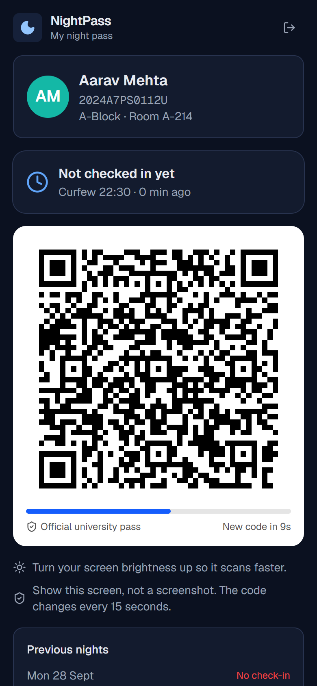
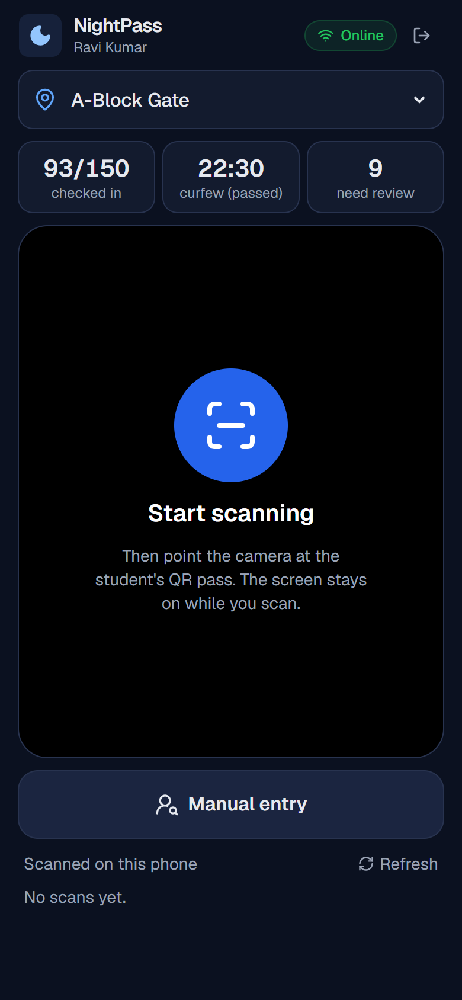
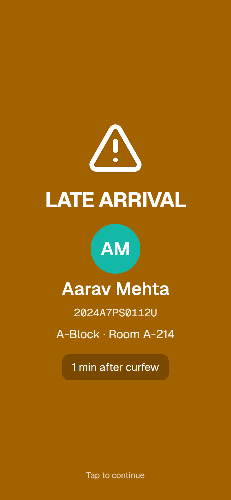

# NightPass

Night attendance for hostels, built for the CampusOps Hackathon (Problem Statement 03: Nighttime Attendance & Presence Scanning, Campus Operations / Security).

Students show a QR pass on their phone at the hostel gate, security scans it with any phone, and the warden sees who is back and who isn't.

**Demo video:** _add link here_
**Live demo:** _add link here_


| Student pass | Guard scanner | After a scan |
| --- | --- | --- |
|  |  |  |

## Why we built this

Night attendance in most hostels is still a paper register at the gate, or a warden going room to room. It's slow when everyone comes back just before curfew, it's easy to sign for a friend, it's hard to read in the dark, and nobody knows who is actually missing until someone goes through the sheets.

## How it works

There are three screens, one for each kind of user.

**Students** open NightPass and show their pass at the gate. The QR code changes every 15 seconds and is signed by the university's server, so a screenshot forwarded to a friend stops working almost immediately. The pass keeps working for 20 minutes without internet. Once they're scanned, their phone shows that they're checked in.

**Security guards** tap "Start scanning" and point the phone at the pass. The whole screen turns green (checked in), amber (late or manual entry) or red (rejected), with the student's name, ID and room, plus a beep and a vibration. The check happens on the phone itself, so it works even with no signal, and scans upload when the connection comes back. If a student's phone is dead, the guard can find them by name, ID or room and mark them present by hand.

**Wardens** get a dashboard that updates every few seconds: how many students are back in each block, who is still out, late arrivals, and anything that needs a second look (duplicate scans, screenshots, invalid codes, manual entries). Records can be searched by name, ID, room, block, night or result, and exported to Excel (CSV).

## Meeting the requirements

| The problem statement asks for | What we did |
| --- | --- |
| A quick, dependable way to record presence | Camera scanning with no typing. The result is worked out on the phone in milliseconds, and a green result clears itself so the next student can step up. |
| Verify each entry against university identity data | Passes can only be created by the server (signed with a private key). Each scan is checked against the active student list, and the guard sees the student's name, ID and room. |
| Record date, time and other details | Every scan is saved with the time, gate, guard, method (QR or manual), result and reason. |
| Let staff review, search and export | Dashboard with live counts, search and filters, and CSV export of both the scan records and the "not back yet" list. |
| Find duplicate, invalid or incomplete entries | Scans are flagged automatically as duplicate, expired (likely a screenshot), invalid or edited, not on the student list, late, or manual. The warden resolves each one with a note. |
| Protect student data and limit access | Separate student, guard and warden roles, checked on every page and every API call. Guards only see name, ID, block and room. |
| Work reliably at night | Dark screen for the gate, torch button, screen stays on, sound and vibration, and full offline scanning. |
| Keep delays at the gate low | No network wait before the result is shown, no typing, one screen. |
| Connect to existing university systems | The student list is imported from a CSV export of the student records system. Sign-in is set up so the demo accounts can be swapped for the university's Google accounts. |

## Running it locally

You need Node.js 20.9 or newer. Nothing else needs to be installed or configured.

```bash
git clone https://github.com/RithikhC/CampusOPS.git
cd CampusOPS
npm install
npm run dev
```

Then open http://localhost:3000 and pick one of the demo accounts. On first start the app creates a small built-in database (in the `.data` folder) with 150 sample students across three hostel blocks, tonight's roll call already in progress, and six earlier nights of history.

### Trying the full flow

1. Sign in as a student (Aarav Mehta) in one browser window. You'll see the QR code changing.
2. Sign in as the guard (Ravi Kumar) in another window or on a phone, tap **Start scanning** and scan the pass. It goes green.
3. Move the pass away for a few seconds and scan it again: red, already scanned. Take a screenshot of a pass, wait a minute, and scan the screenshot: red, expired code.
4. Sign in as the warden (Dr. Meera Nair). The numbers update on their own. Look at **Not back yet**, **Needs review** and **Search & export**.

Phones only allow the camera on https pages, so to scan with a phone either use the deployed link or follow the tunnel instructions in [docs/DEPLOYMENT.md](docs/DEPLOYMENT.md#testing-on-a-phone-during-development). Without a camera you can still use **Manual entry** and the "Type / paste code" option (this also works with USB or Bluetooth barcode scanners).

Before recording a demo, go to **Settings** on the warden dashboard and press **Reset demo data**.

### Useful commands

| Command | What it does |
| --- | --- |
| `npm run dev` | Starts the app on port 3000 |
| `npm test` | Runs the unit tests for pass signing and the scan rules |
| `npm run lint` and `npm run typecheck` | Code checks |
| `npm run build` then `npm start` | Production build |
| `npm run keys` | Generates the secret keys needed when deploying |

## Documents

- [Technical overview](docs/TECHNICAL.md): architecture, how the QR pass works, scan rules, offline sync, data model, API and security
- [Deployment guide](docs/DEPLOYMENT.md): Vercel with a free Postgres database, any Node host, Docker, and testing on a phone
- [Demo video plan](docs/DEMO_SCRIPT.md): the scene-by-scene plan and narration for our 3-minute video

## Tech stack

- **Next.js 16 with React 19 and TypeScript**: the three screens and the API in one project. The app can be added to a phone's home screen.
- **PostgreSQL**: PGlite (Postgres that runs inside Node) for local use, so there's nothing to install, and any hosted Postgres in production. Same SQL for both.
- **Ed25519 signatures** (`@noble/curves`) for the QR passes. The server keeps the private key. Scanners only get the public key, so they can check passes offline but can't make new ones.
- **Scanning**: the browser's built-in barcode detector where it exists (Android), and `jsQR` everywhere else (iPhone).
- **Tailwind CSS** for styling, `lucide-react` icons, `jose` for signed session cookies.
- **Vitest** for tests, ESLint, and a GitHub Actions workflow that runs lint, type check, tests and a build on every push.

## Project layout

```
src/
  app/
    page.tsx            sign-in page
    student/            student pass
    guard/              gate scanner, result screen, manual entry
    admin/              warden dashboard
    api/                server routes (sign-in, pass, scans, admin)
  components/           camera scanner, QR code, sound/vibration, shared UI
  lib/
    pass.ts             QR pass format and signing (used by server and phone)
    verify.ts           scan rules (used by server and phone)
    scans.ts            saving scans on the server
    queries.ts          data for each screen
    admin.ts            warden actions (resolve, curfew, import)
    db.ts, schema.ts    database connection and tables
    seed.ts             demo data
  proxy.ts              blocks pages a role shouldn't see
tests/                  unit tests
docs/                   technical overview, deployment guide, video plan
```

## Privacy and security

- A pass can't be forged or reused: only the server can sign one, it expires within about 30 seconds, and editing it breaks the signature.
- Each role only gets what it needs. Guards don't see emails. Students only see their own record. Warden pages and APIs are blocked for everyone else.
- Every scan attempt is stored, including rejected ones, with who scanned it and where. Warden actions such as resolving a flag, changing curfew or importing students are logged too.
- We don't store photos or phone numbers in this version.

## Expected impact

These are our estimates. We plan to confirm them by timing real scans.

- A paper register takes roughly 20 to 30 seconds per student. A scan takes about 2 to 3 seconds. For 150 students coming back around curfew, that is close to an hour of queueing reduced to a few minutes.
- The warden gets the list of missing students the moment curfew passes, instead of counting sheets.
- Signing for a friend stops working, because screenshots expire and duplicates are flagged.
- No hardware to buy, since guards use phones they already have.

## What we'd add next

- Sign in with university Google accounts
- Student ID-card photo on the scan result
- Alerts to the warden for students still missing 30 minutes after curfew
- Automatic student list sync instead of CSV upload
- Linking with approved leave / outpasses so those students aren't marked missing

## License

MIT
