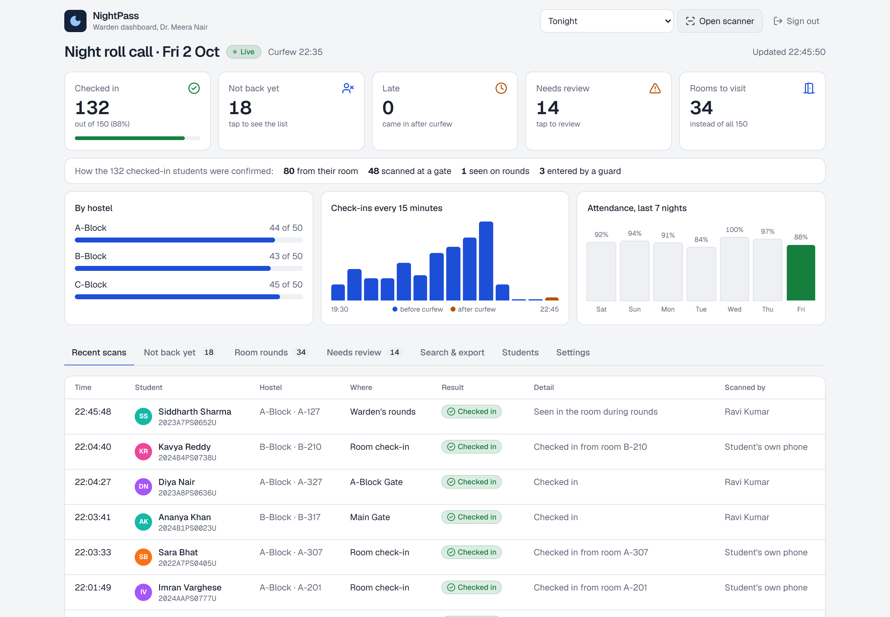
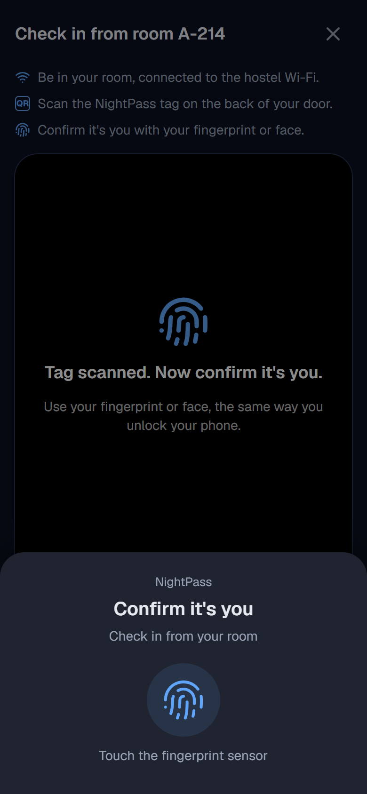
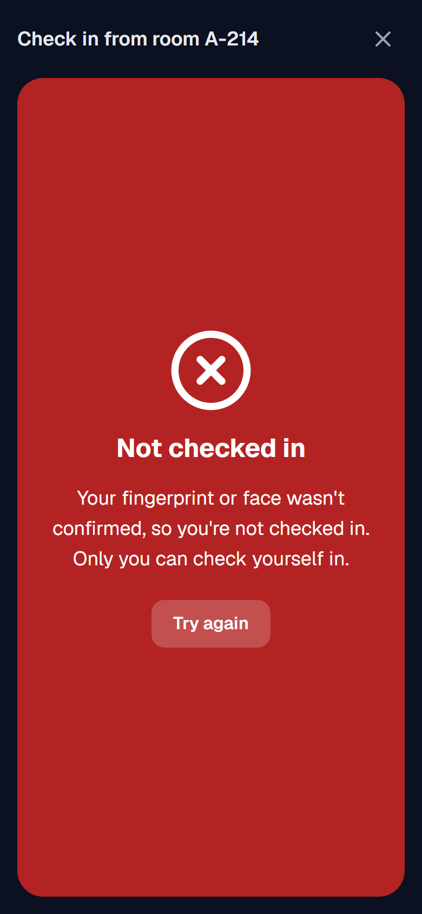
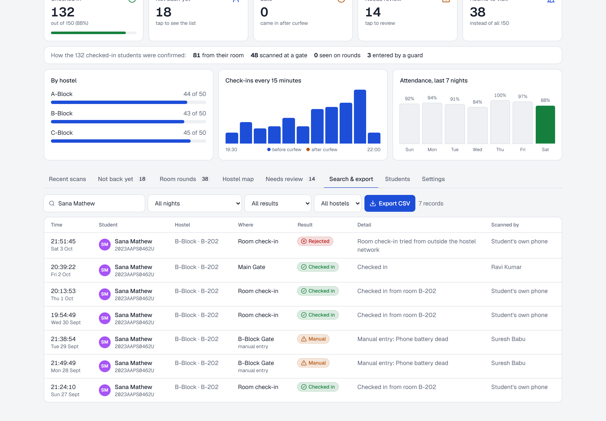
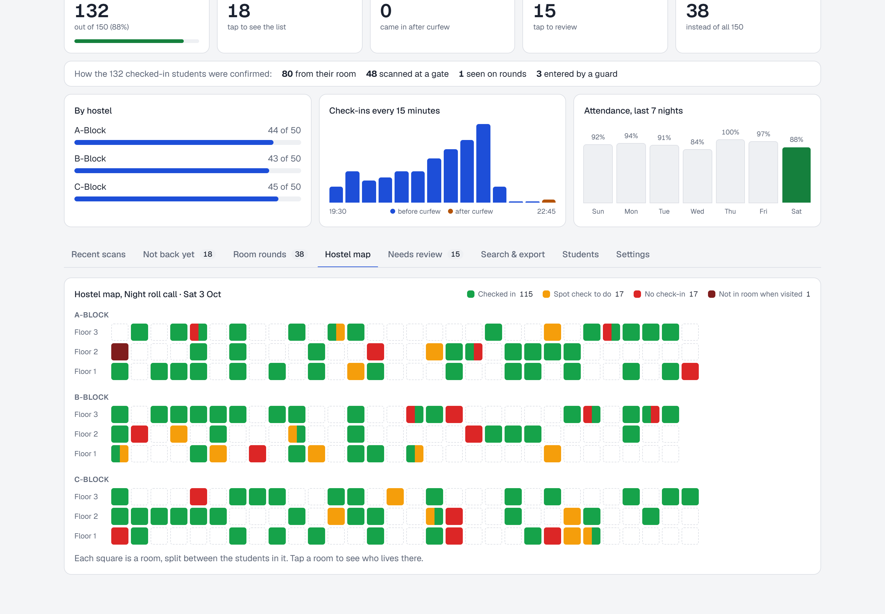
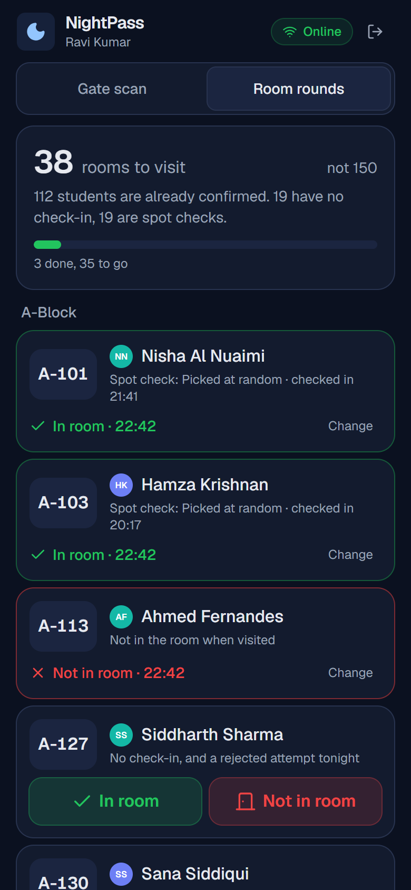
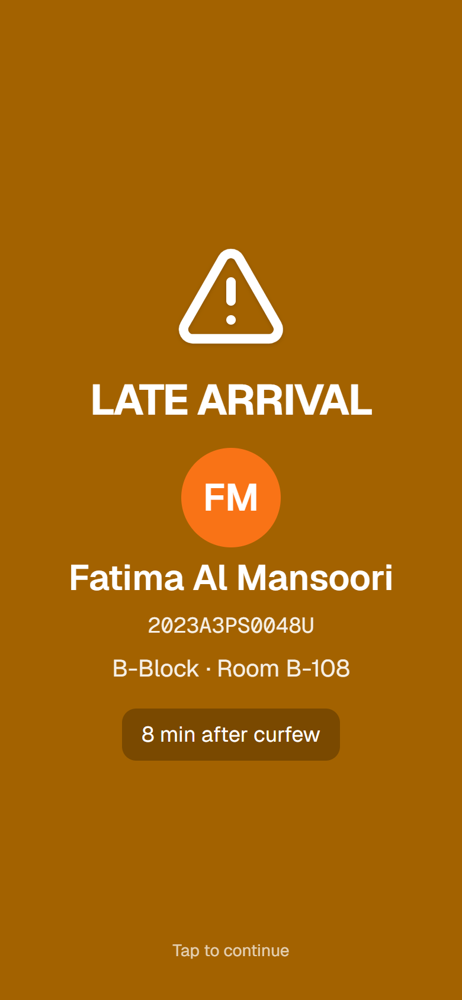
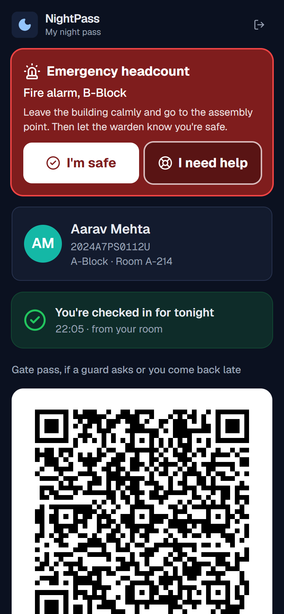
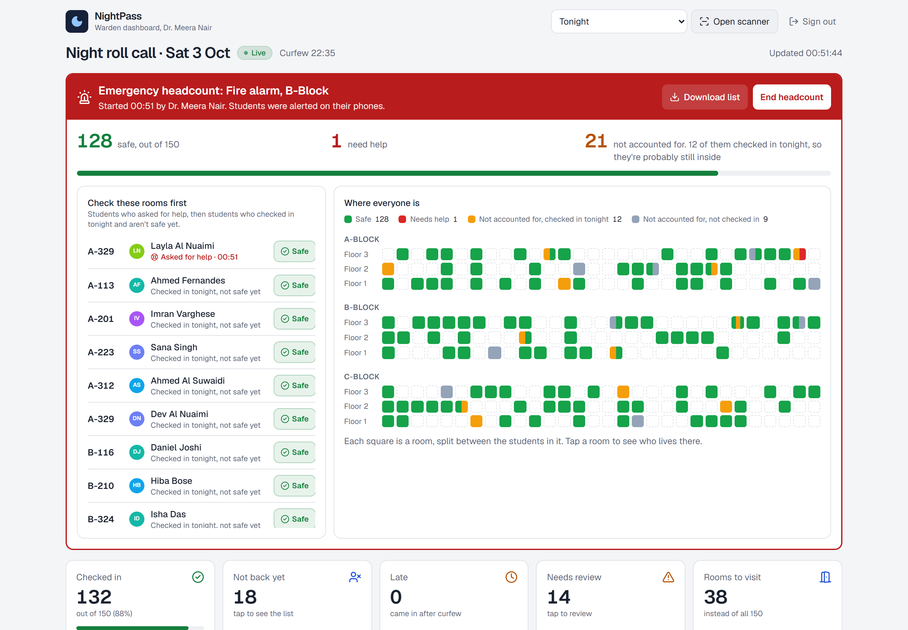

# NightPass

A night attendance scanning system for hostels: **record, verify and review** who is in at night. Built for the CampusOps Hackathon, Problem Statement 03: Nighttime Attendance & Presence Scanning (Campus Operations / Security).

**Live demo:** https://rithikhc.github.io/CampusOPS/ (opens in any browser, nothing to install)
**Demo video (2:54):** [docs/NightPass-demo.mp4](docs/NightPass-demo.mp4). It shows every requirement below being met.



## The problem

> Recording and verifying student attendance or presence during nighttime campus activities can be slow, inconsistent, and difficult to consolidate when handled manually.

In a hostel today that means a warden walking to every one of 150 rooms each night, a paper register at the gate that's easy to sign for a friend, records nobody can search or combine afterwards, and no way to know who is missing until the round is over.

## Our solution

NightPass replaces the manual round and the paper register with scanning, in three steps.

| 1. Record | 2. Verify | 3. Review |
| --- | --- | --- |
|  |  |  |
| Students scan the NightPass tag in their own room, or show their pass to a guard at the gate. One scan, no queue. | Every entry is checked against the student's identity and the student list. Anything that doesn't match is refused. | Staff see every record live, search it, export it to Excel, and follow up on anything flagged. |

### 1. Record: scanning presence

- **From the room.** Most students are in their room at night. They tap **Check in from my room** and scan the signed tag on the back of their door. Nobody queues and nobody knocks.
- **At the gate.** Students coming back late show a QR pass that changes every 15 seconds. A guard scans it with any phone, even with no signal at the gate, and the scan uploads when the signal is back.
- **By hand, when needed.** A student without their phone is found by name, ID or room and entered by the guard, with a reason.

Every entry, including refused ones, is saved with the **date and time**, the place (room, gate or rounds), who or what recorded it, the method, the result and the reason.

### 2. Verify: every entry is checked

A room check-in only counts with all of these:

- **the right person**: the student's own fingerprint or face, checked by their phone through a passkey. NightPass never sees or stores any biometric data. A roommate holding your phone can't pass it.
- **the right phone**: the one registered to that student. A friend's phone is refused.
- **the right room**: the signed tag of their own room. The room next door's tag is refused.
- **the right place and time**: on the hostel Wi-Fi (from a café it's refused), in the check-in window around curfew.

At the gate, the pass must be signed by the university, less than about 30 seconds old (a screenshot fails), and belong to a student on the active list.

### 3. Review: see, search, export and follow up

- **Live dashboard**: who is in, who isn't back yet, how each student was confirmed, check-ins over time, the last seven nights, and a **hostel map** of every room coloured by status.
- **Search & export**: by name, ID, room, block, night or result, exported to Excel (CSV). The "not back yet" list exports too.
- **Flagged for follow-up**: duplicates, expired screenshots, codes that aren't NightPass passes, students not on the list, refused room check-ins, manual entries, late arrivals and students not found in their room. The warden closes each one with a note.
- **Follow-up rounds**: instead of all 150 rooms, the warden's phone lists only the rooms that need a look: students with no check-in, plus spot checks on less certain check-ins (a refused attempt, no fingerprint check, a new phone, missed nights, or picked at random). One tap per door: **In room** or **Not in room**. In our sample hostel that's **about 35 rooms instead of 150**.

| Hostel map | Warden's rounds | Late arrival at the gate |
| --- | --- | --- |
|  |  |  |

## Meeting the problem statement

| The problem statement asks for | What NightPass does |
| --- | --- |
| A quick and dependable method for scanning or recording presence | One scan of the room tag from the student's own phone, or one scan of their pass at the gate. The gate scanner gives a result in milliseconds and works offline. |
| Verify each entry against authorized university identity information | The student's fingerprint or face on their registered phone (passkey), room tags and passes signed with the university's key, and a check against the active student list. |
| Record essential details, including date and time | Every attempt: date, time, place, method, who recorded it, result, reason, and whether a fingerprint was used. |
| Allow authorized staff to review, search and export records | Live dashboard and hostel map, search and filters across nights, CSV export of the records and the "not back yet" list. |
| Identify duplicate, invalid or incomplete entries for follow-up | Duplicates, expired or forged codes, students not on the list, refused room check-ins, manual entries and students not found in their room are all flagged and resolved with a note. Students with no check-in go on the warden's rounds. |
| Protect student data and restrict access | Separate student, guard and warden roles, checked on every page and every API call. Students only see their own record. No biometric data is stored. |
| Work reliably in nighttime conditions | Dark screens, a torch button, the screen stays on, sound and vibration, and an offline gate scanner. |
| Minimize delays at scanning points | Students who are in scan from their room, so the gate only sees late arrivals. No typing anywhere. |
| Integrate with university systems where feasible | The student list is imported from the student records system (CSV). The hostel network check uses the campus Wi-Fi ranges. Sign-in is ready to switch to the university's Google accounts. |
| Expected outcome: more accurate, visible records with less manual effort and waiting | Every attempt is on record and searchable, the warden visits about 35 rooms instead of 150, and there is no queue at curfew. |

## Add-on: emergency headcount

Beyond the brief, the same records help in an emergency. If the fire alarm goes off at night, the warden starts a headcount from the dashboard. Students tap **I'm safe** or **I need help** on their phone, guards scan passes at the assembly point, and the dashboard lists the rooms to check first: students who checked in tonight and aren't safe yet, because they are probably still inside.

| On the student's phone | On the dashboard |
| --- | --- |
|  |  |

## Trying the live demo

The [live demo](https://rithikhc.github.io/CampusOPS/) shows the student's phone, the guard / warden's phone and the dashboard side by side. It's the same app running entirely in your browser with sample data, so every visitor gets their own copy. The buttons at the top follow one night:

1. **Record and verify from the room.** Press **Aarav checks in from the room**: his phone scans the door tag and asks for his fingerprint. Then try entries that fail verification: from the room next door, from outside the hostel, from a friend's phone, or with someone else's finger. Each one is refused and recorded.
2. **Record at the gate.** Hold a pass up to the scanner, scan it twice, use an old screenshot, take the scanner offline, or use **Manual entry** on the guard's phone.
3. **Follow up after curfew.** Press **Curfew passes: start the rounds** and tap **In room** or **Not in room** on the warden's phone.
4. **Review.** On the dashboard, open **Hostel map**, **Needs review** and **Search & export**.
5. **Add-on.** Start a fire-alarm headcount and tap **I'm safe** on the student's phone.

The phones in the demo use simulated cameras and a simulated fingerprint sensor (it answers with a real passkey response, which is checked the same way). On a real phone you can open the [student screen](https://rithikhc.github.io/CampusOPS/student/) or the [gate scanner](https://rithikhc.github.io/CampusOPS/guard/) on its own and use the real camera.

## Running it locally

You need Node.js 20.9 or newer. Nothing else needs to be installed or configured.

```bash
git clone https://github.com/RithikhC/CampusOPS.git
cd CampusOPS
npm install
npm run dev
```

Then open http://localhost:3000 and pick one of the demo accounts. On first start the app creates a small built-in database (in the `.data` folder) with 150 sample students across three hostel blocks, tonight's roll call already in progress, and six earlier nights of history.

### Trying the full flow

1. **Warden:** sign in as Dr. Meera Nair. Open **Students**, then **Room tags**. These are the stickers that go inside each room, ready to print. Under **Settings** you can move tonight's curfew.
2. **Student:** sign in as Aarav Mehta in another browser window or on a phone, and tap **Check in from my room**. Scan the A-214 tag, or press **Copy code** under that tag on the warden's page and paste it in. The browser then asks for your fingerprint, face or device PIN (Windows Hello, Touch ID, Android or iPhone). The first time, this sets up the passkey. On a device with no fingerprint, face or PIN lock the check-in still goes through, but it's marked for a spot check. The button opens 90 minutes before curfew.
3. **Gate:** sign in as the guard (Ravi Kumar). Under **Gate scan**, scan a student's pass, or use **Manual entry** and **Type / paste code**. After curfew it comes up as late.
4. **Follow-up:** once curfew has passed, open **Room rounds** on the guard's phone and mark rooms **In room** or **Not in room**.
5. **Review:** back on the dashboard, look at **Hostel map**, **Not back yet**, **Needs review** and **Search & export**.

Phones only allow the camera and passkeys on https pages, so to use a real phone either use the live demo or follow the tunnel instructions in [docs/DEPLOYMENT.md](docs/DEPLOYMENT.md#testing-on-a-phone-during-development).

To start again with fresh data, go to **Settings** on the warden dashboard and press **Reset demo data**.

### Useful commands

| Command | What it does |
| --- | --- |
| `npm run dev` | Starts the app on port 3000 |
| `npm test` | Runs the 51 automated tests (scan rules, passkeys, tag and pass signing, room check-in, rounds, emergency headcount, demo data) |
| `npm run lint` and `npm run typecheck` | Code checks |
| `npm run build` then `npm start` | Production build |
| `npm run keys` | Generates the secret keys needed when deploying |
| `npm run build:pages` then `npm run preview:pages` | Builds the browser-only demo (the GitHub Pages version) and serves it at http://localhost:4000/CampusOPS/ |

## Documents

- [Technical overview](docs/TECHNICAL.md): architecture, how each entry is recorded and verified, the fingerprint check, the gate pass, offline sync, flags and rounds, data model, API and security
- [Deployment guide](docs/DEPLOYMENT.md): setting up a hostel, GitHub Pages, Vercel with a free Postgres database, any Node host, Docker, and testing on a phone
- [Demo video](docs/NightPass-demo.mp4): 2 minutes 54 seconds, with captions
- [What's in the video](docs/DEMO_SCRIPT.md)

## Tech stack

- **Next.js 16 with React 19 and TypeScript**: every screen and the API in one project. The app can be added to a phone's home screen.
- **PostgreSQL**: PGlite (Postgres that runs inside Node) for local use, so there's nothing to install, and any hosted Postgres in production. Same SQL for both.
- **Passkeys (WebAuthn)** for the fingerprint check. The phone keeps the private key in its secure hardware and only uses it after its own fingerprint, face or PIN check. The server stores the public key and checks a P-256 signature (`@noble/curves`) on every check-in.
- **Ed25519 signatures** (`@noble/curves`) for room tags and gate passes. The server keeps the private key. Phones only get the public key, so a guard's phone can check a pass offline but nobody can make their own tag or pass.
- **Scanning**: the browser's built-in barcode detector where it exists (Android), and `jsQR` everywhere else (iPhone).
- **Tailwind CSS** for styling, `lucide-react` icons, `jose` for signed session cookies.
- **Vitest** for tests, ESLint, and a GitHub Actions workflow that runs lint, type check, tests and a build on every push.
- **GitHub Pages demo**: a static build of the same screens where the API runs in the browser on PGlite (Postgres compiled to WebAssembly). A second workflow republishes it on every push. See [the technical overview](docs/TECHNICAL.md#the-browser-demo-github-pages).

## Project layout

```
src/
  app/
    page.tsx            sign-in page
    student/            student screen and room check-in (plus the emergency alert)
    guard/              gate scanner, manual entry, room rounds (plus the assembly point headcount)
    admin/              warden dashboard, hostel map, records, flags (plus the emergency panel)
    api/                server routes (sign-in, pass, check-in, scans, rounds, admin, emergency)
  components/           camera scanner, passkey (fingerprint) client, QR code, sound/vibration, shared UI
  lib/
    roomcheck.ts        room check-in rules (recording and verifying a check-in)
    webauthn.ts         passkey checks: challenges and signature verification
    roomtag.ts          signed room tags
    network.ts          hostel network check
    pass.ts             gate pass format and signing (used by server and phone)
    verify.ts           gate scan rules (used by server and phone)
    scans.ts            saving gate scans on the server
    rounds.ts           the follow-up list, and recording visits
    queries.ts          data for each screen, including the hostel map
    admin.ts            warden actions (resolve, curfew, import, room tags)
    emergency.ts        add-on: emergency headcount
    db.ts, schema.ts    database connection and tables
    seed.ts             demo data
  demo/                 browser-only demo: in-browser API, simulated cameras and fingerprint sensor, side-by-side page
  proxy.ts              blocks pages a role shouldn't see
tests/                  automated tests
docs/                   technical overview, deployment guide, demo video
```

## Privacy and security

- **No biometric data is collected.** The fingerprint or face check happens inside the phone, the same way it unlocks. NightPass only receives a signature that proves the check passed.
- Only the server can create room tags and passes. A gate pass expires within about 30 seconds, and editing a tag or a pass breaks its signature.
- The hostel network check looks at the address the request arrives from, which is decided by the server and not by the phone.
- Each role only gets what it needs. Guards don't see emails. Students only see their own record. Warden pages and APIs are blocked for everyone else.
- Every attempt is stored, including refused ones, with who or what recorded it. Warden actions such as resolving a flag, changing curfew and importing students are logged too.

The limits of each check, and what covers them, are listed in the [technical overview](docs/TECHNICAL.md#security).

## Expected impact

These figures come from our sample data. A two-week pilot in one hostel block would measure them for real.

- **Less manual effort:** about 35 rooms to visit instead of 150 on a typical night, in walking order, with the reason for each. No paper registers.
- **Less waiting:** students who are in scan from their room, so there's no queue at curfew. The gate only sees late arrivals.
- **More accurate records:** a friend can't check in for you, not even with your phone. Every attempt is recorded, and duplicates and screenshots are caught.
- **Better visibility:** at curfew the warden already knows who hasn't checked in, and every night can be searched and exported.
- **Cost:** one printed sticker per room. Everything else runs on phones people already have.

## What we'd add next

- Sign in with university Google accounts
- Automatic student list sync instead of CSV upload
- Linking with approved leave / outpasses so those students aren't marked missing
- Alerts to the warden for students still missing 30 minutes after curfew
- Adjusting the spot-check rate per hostel, based on how often a spot check finds an empty room
- For the add-on: push notifications, so the emergency alert reaches phones even when NightPass isn't open

## License

MIT
