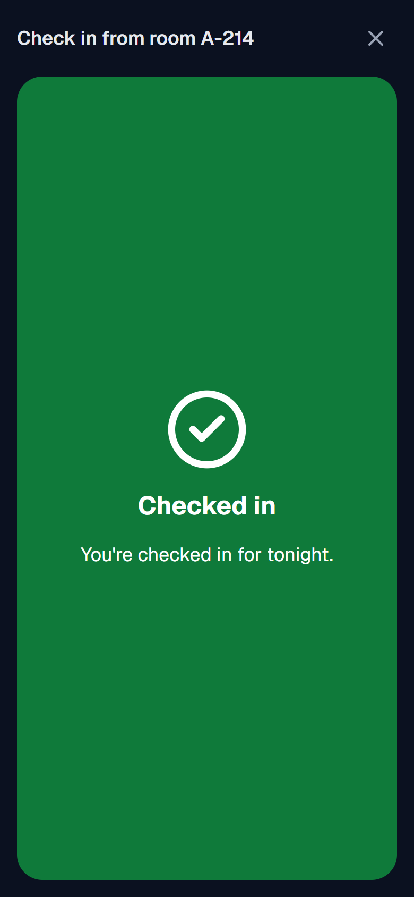
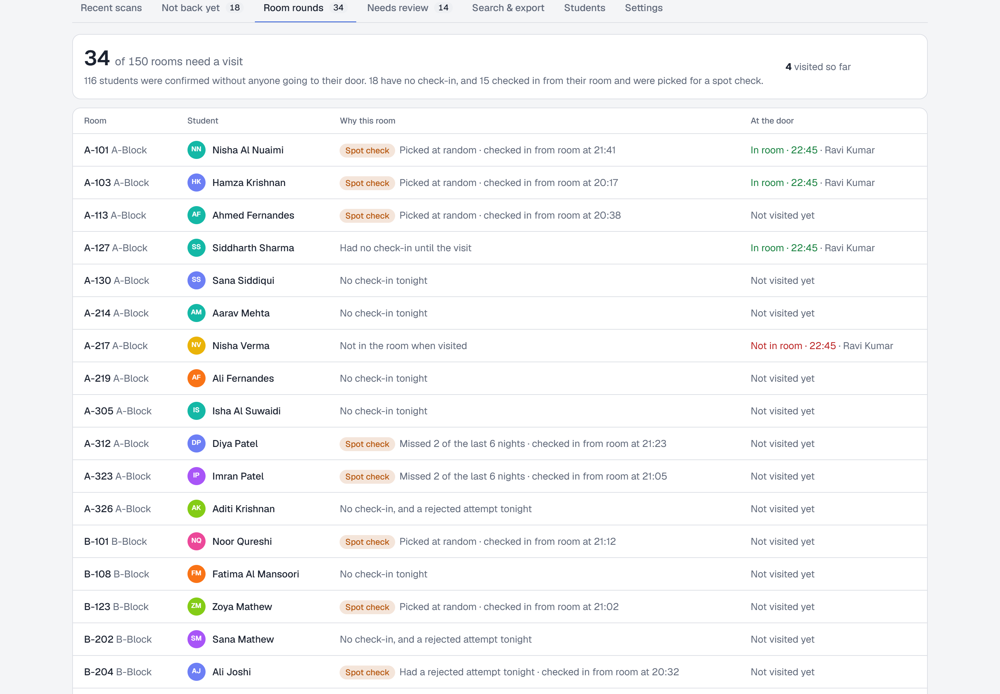

# NightPass

Night attendance for hostels, without knocking on every door. Built for the CampusOps Hackathon (Problem Statement 03: Nighttime Attendance & Presence Scanning, Campus Operations / Security).

**Live demo:** https://rithikhc.github.io/CampusOPS/ (opens in any browser, nothing to install)
**Demo video (2:43):** [docs/NightPass-demo.mp4](docs/NightPass-demo.mp4)


| Student's phone | Checked in from the room | Warden's rounds after curfew | Late arrival at the gate |
| --- | --- | --- | --- |
|  |  |  |  |

## The problem

Today a warden walks to every room, every night, to see who is in. In a hostel of 150 students that's 150 doors, one by one. Students who are in their room get disturbed anyway, the record is on paper (if there is one), and nobody knows who is missing until the round is over.

## Our idea

Most students are in their room at curfew. They shouldn't need a knock, and the warden's time should go to the rooms where there's actually a question. NightPass does three things.

**1. Students check in from their own room.** They tap **Check in from my room** and scan the NightPass tag stuck on the back of their door. The check-in only counts with three proofs together:

- the **right phone**: the one registered to that student (a friend's phone is refused)
- the **right place**: the signed tag of their own room, scanned while on the hostel Wi-Fi (from a café, or with another room's tag, it's refused)
- the **right time**: the check-in window around curfew

Every refused attempt is recorded, so the warden sees it.

**2. The warden only visits the rooms that need a look.** After curfew the warden's phone shows a walking list, sorted by block and room:

- students who **haven't checked in**
- **spot checks** on room check-ins that are less certain: a rejected attempt tonight, a new phone registered tonight, or missed nights this week
- a small **random sample**, so nobody can count on never being checked

At each door it's one tap: **In room** or **Not in room**. "Not in room" for someone who checked in cancels their check-in and flags it. In our sample hostel that's **about 30 rooms instead of 150**.

**3. Late arrivals use the gate.** Students coming back after curfew show a QR pass that changes every 15 seconds (so a screenshot is useless), and a guard scans it with any phone, even with no signal at the gate.

The warden's dashboard shows all of it live: who is in, how each student was confirmed (from their room, at the gate, or on rounds), who isn't back, the rounds list and its progress, anything that needs review, and exports to Excel.



## Trying the live demo

The [live demo](https://rithikhc.github.io/CampusOPS/) shows the student's phone, the warden's phone and the dashboard side by side. It's the same app running entirely in your browser with sample data, so every visitor gets their own copy. The buttons at the top follow one night:

1. **In the room, before curfew.** Press **Aarav checks in from the room** and watch his phone scan the door tag. Then try **from outside the hostel** and **from a friend's phone**: both are refused and show up on the dashboard.
2. **After curfew.** Press **Curfew passes: start the rounds**. The warden's phone shows the short list. Tap **In room** or **Not in room** on any card.
3. **At the gate.** Hold a pass up to the scanner, try an old screenshot, or take the scanner offline.

The two phones in the demo use simulated camera feeds. On a real phone you can open the [student screen](https://rithikhc.github.io/CampusOPS/student/) or the [gate scanner](https://rithikhc.github.io/CampusOPS/guard/) on its own and use the real camera.

## Meeting the requirements

| The problem statement asks for | What we did |
| --- | --- |
| A quick, dependable way to record presence | One scan of the room tag from the student's own phone, or one scan at the gate. The guard's result is worked out on the phone in milliseconds. |
| Verify each entry against university identity data | Room tags and passes are signed by the university's key, a check-in only counts from the phone registered to the student, and everything is checked against the active student list. |
| Record date, time and other details | Every attempt is saved with the time, the place (room, gate or rounds), who recorded it, the method, the result and the reason. |
| Let staff review, search and export | Live dashboard, the rounds list, search and filters, and CSV export of both the records and the "not back yet" list. |
| Find duplicate, invalid or incomplete entries | Flags for refused room check-ins (wrong phone, outside the hostel, wrong room), expired or forged codes, duplicates, late arrivals, manual entries, and students not found in their room. The warden resolves each one with a note. |
| Protect student data and limit access | Separate student, guard and warden roles, checked on every page and every API call. Students only see their own record. |
| Work reliably at night | Dark screens, a torch button, the screen stays on, sound and vibration, and the gate scanner works offline. |
| Keep delays low | Students who are already in don't queue anywhere, and there is no typing on any screen. |
| Connect to existing university systems | The student list is imported from a CSV export of the student records system. The hostel network check uses the campus Wi-Fi address ranges. Sign-in is set up so the demo accounts can be swapped for the university's Google accounts. |

## Running it locally

You need Node.js 20.9 or newer. Nothing else needs to be installed or configured.

```bash
git clone https://github.com/RithikhC/CampusOPS.git
cd CampusOPS
npm install
npm run dev
```

Then open http://localhost:3000 and pick one of the demo accounts. On first start the app creates a small built-in database (in the `.data` folder) with 150 sample students across three hostel blocks, tonight's roll call already in progress, and six earlier nights of history.

### Trying the full flow

1. **Warden:** sign in as Dr. Meera Nair. Open **Students**, then **Room tags**. These are the stickers that go inside each room, ready to print. Under **Settings** you can move tonight's curfew.
2. **Student:** sign in as Aarav Mehta in another browser window or on a phone, and tap **Check in from my room**. Scan the A-214 tag, or press **Copy code** under that tag on the warden's page and paste it in. (The button opens 90 minutes before curfew.)
3. **Rounds:** once curfew has passed, sign in as the guard (Ravi Kumar), open **Room rounds**, and mark rooms **In room** or **Not in room**.
4. **Gate:** under **Gate scan**, scan a student's pass, or use **Manual entry** and **Type / paste code**. After curfew it comes up as late.
5. Back on the dashboard, look at **Room rounds**, **Not back yet**, **Needs review** and **Search & export**.

Phones only allow the camera on https pages, so to scan with a real phone either use the live demo or follow the tunnel instructions in [docs/DEPLOYMENT.md](docs/DEPLOYMENT.md#testing-on-a-phone-during-development).

To start again with fresh data, go to **Settings** on the warden dashboard and press **Reset demo data**.

### Useful commands

| Command | What it does |
| --- | --- |
| `npm run dev` | Starts the app on port 3000 |
| `npm test` | Runs the 34 automated tests (pass and tag signing, scan rules, room check-in, rounds, demo data) |
| `npm run lint` and `npm run typecheck` | Code checks |
| `npm run build` then `npm start` | Production build |
| `npm run keys` | Generates the secret keys needed when deploying |
| `npm run build:pages` then `npm run preview:pages` | Builds the browser-only demo (the GitHub Pages version) and serves it at http://localhost:4000/CampusOPS/ |

## Documents

- [Technical overview](docs/TECHNICAL.md): architecture, room check-in rules, how the rounds list is built, the gate pass, offline sync, data model, API and security
- [Deployment guide](docs/DEPLOYMENT.md): GitHub Pages, Vercel with a free Postgres database, any Node host, Docker, and testing on a phone
- [Demo video](docs/NightPass-demo.mp4): 2 minutes 43 seconds, with captions
- [What's in the video](docs/DEMO_SCRIPT.md)

## Tech stack

- **Next.js 16 with React 19 and TypeScript**: every screen and the API in one project. The app can be added to a phone's home screen.
- **PostgreSQL**: PGlite (Postgres that runs inside Node) for local use, so there's nothing to install, and any hosted Postgres in production. Same SQL for both.
- **Ed25519 signatures** (`@noble/curves`) for room tags and gate passes. The server keeps the private key. Phones only get the public key, so a guard's phone can check a pass offline but nobody can make their own tag or pass.
- **Scanning**: the browser's built-in barcode detector where it exists (Android), and `jsQR` everywhere else (iPhone).
- **Tailwind CSS** for styling, `lucide-react` icons, `jose` for signed session cookies.
- **Vitest** for tests, ESLint, and a GitHub Actions workflow that runs lint, type check, tests and a build on every push.
- **GitHub Pages demo**: a static build of the same screens where the API runs in the browser on PGlite (Postgres compiled to WebAssembly). A second workflow republishes it on every push. See [the technical overview](docs/TECHNICAL.md#the-browser-demo-github-pages).

## Project layout

```
src/
  app/
    page.tsx            sign-in page
    student/            student screen and room check-in
    guard/              gate scanner, room rounds, result screen, manual entry
    admin/              warden dashboard
    api/                server routes (sign-in, pass, check-in, scans, rounds, admin)
  components/           camera scanner, QR code, sound/vibration, shared UI
  lib/
    roomcheck.ts        room check-in rules (the three proofs)
    rounds.ts           who goes on the warden's list, and recording visits
    roomtag.ts          signed room tags
    network.ts          hostel network check
    pass.ts             gate pass format and signing (used by server and phone)
    verify.ts           gate scan rules (used by server and phone)
    scans.ts            saving gate scans on the server
    queries.ts          data for each screen
    admin.ts            warden actions (resolve, curfew, import, room tags)
    db.ts, schema.ts    database connection and tables
    seed.ts             demo data
  demo/                 browser-only demo: in-browser API, simulated cameras, side-by-side page
  proxy.ts              blocks pages a role shouldn't see
tests/                  automated tests
docs/                   technical overview, deployment guide, demo video
```

## Privacy and security

- Only the server can create room tags and passes. A gate pass expires within about 30 seconds, and editing a tag or a pass breaks its signature.
- The "registered phone" is a random ID the app stores on the phone the first time the student checks in. We don't collect phone numbers, hardware IDs, photos or GPS location.
- The hostel network check looks at the address the request arrives from, which is decided by the server and not by the phone.
- Each role only gets what it needs. Guards don't see emails. Students only see their own record. Warden pages and APIs are blocked for everyone else.
- Every attempt is stored, including refused ones, with who or what recorded it. Warden actions such as resolving a flag, changing curfew or importing students are logged too.

The limits of each check, and what covers them, are listed in the [technical overview](docs/TECHNICAL.md#security).

## Expected impact

These figures come from our sample data. A two-week pilot in one hostel block would measure them for real.

- **Rounds:** about 30 rooms to visit instead of 150 on a typical night, in walking order, with the reason for each.
- **Students who are in** aren't disturbed.
- **At curfew** the warden already knows who hasn't checked in, before the round starts.
- **Cheating gets harder than it is today:** a friend can't check in for you from their phone, check-ins from outside the hostel are refused and recorded, and nobody can predict the spot checks.
- **Cost:** one printed sticker per room. Everything else runs on phones people already have.

## What we'd add next

- Sign in with university Google accounts
- Alerts to the warden for students still missing 30 minutes after curfew
- Automatic student list sync instead of CSV upload
- Linking with approved leave / outpasses so those students aren't marked missing
- Adjusting the spot-check rate per hostel, based on how often a spot check finds an empty room

## License

MIT
