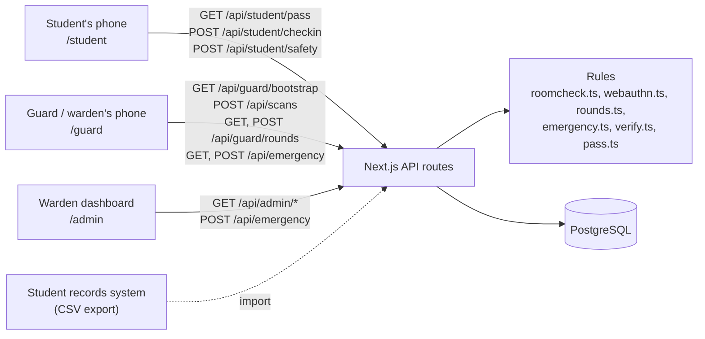
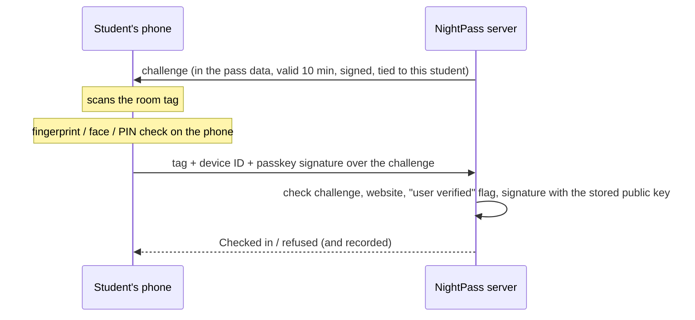
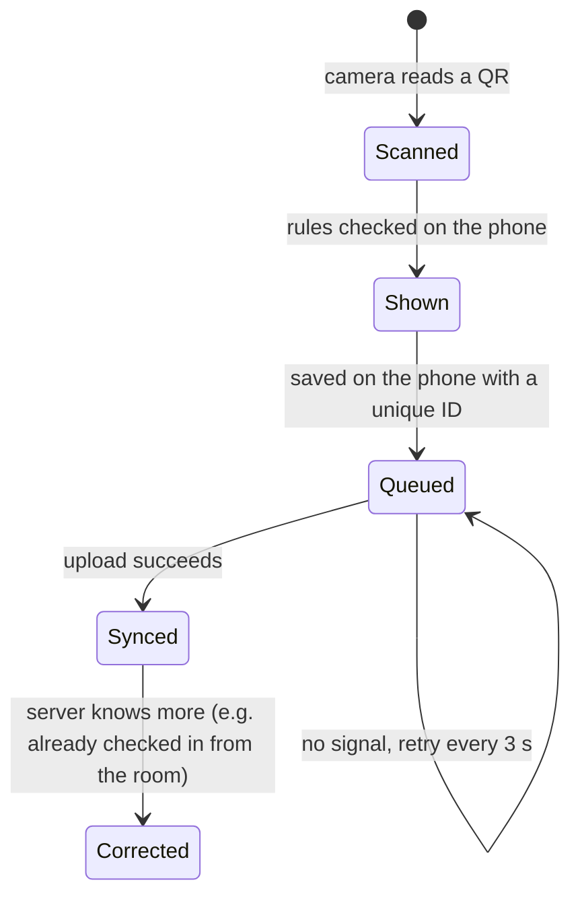
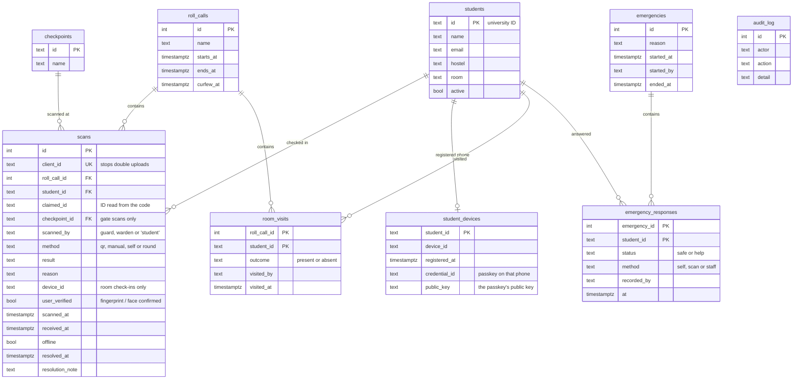

# Technical overview

This document explains how NightPass is put together and why we made the choices we did.

## The idea in one paragraph

Problem Statement 03 asks for a night attendance scanning system that lets campus teams **record, verify and review** presence, and flag duplicate, invalid or incomplete entries. NightPass records presence with one scan: students who are already in scan the signed tag in their own room, and late arrivals are scanned at the gate. Every entry is verified against the student's identity (their fingerprint on their registered phone, through a passkey) and the student list, and saved with the date, time, place and result. Staff review, search and export everything from a live dashboard, follow up on anything flagged, and the warden only visits the rooms that still need a look. An emergency headcount is included as an add-on that reuses the same records.

| Requirement | Where it's handled |
| --- | --- |
| Quick, dependable scanning | [Room check-in](#room-check-in), [the gate pass](#recording-at-the-gate-the-pass), [offline scanning](#offline-scanning-and-sync) |
| Verify against university identity | [The four proofs](#the-four-proofs), [the fingerprint check](#the-fingerprint-check-passkeys), [gate scan rules](#gate-scan-rules) |
| Record date, time and details | [Data model](#data-model) (`scans` keeps every attempt) |
| Review, search and export | [Reviewing records](#reviewing-records-search-export-and-flags), [the hostel map](#the-hostel-map) |
| Flag duplicate, invalid or incomplete entries | [Gate scan rules](#gate-scan-rules), [the four proofs](#the-four-proofs), [follow-up rounds](#follow-up-the-wardens-rounds) |
| Security, night conditions, low delay | [Security](#security), [offline scanning](#offline-scanning-and-sync) |

## Architecture



NightPass is a single Next.js 16 app. It serves three front ends (student, guard/warden phone, warden dashboard) and a small JSON API.

- **Access control.** `src/proxy.ts` checks the session cookie before any student, guard or warden page loads, and sends people to the right screen for their role. Every API route checks the role again (`authorize()` in `src/lib/auth.ts`), so the API can't be used to get around the pages.
- **Rules live in plain functions.** Room check-in is in `src/lib/roomcheck.ts`, the passkey checks in `src/lib/webauthn.ts`, the rounds list in `src/lib/rounds.ts`, the headcount in `src/lib/emergency.ts`, and the gate scan rules in `src/lib/verify.ts`. They take a database handle and the current time, so they are easy to test, and the browser demo runs the very same functions.
- **Database.** `src/lib/db.ts` connects to Postgres if `DATABASE_URL` is set. If it isn't, it starts PGlite, a build of Postgres that runs inside Node and stores its files in `./.data`. Both use the same SQL, so anyone can clone the repo and run the full system with `npm run dev`.

## Room check-in

A student taps **Check in from my room**, scans the tag on the back of their door, and confirms with their fingerprint or face. The phone sends `{ tag, deviceId, challenge, passkey }` to `POST /api/student/checkin`, and `roomCheckIn()` decides.

### Room tags

```
NR1.<base64url("A-Block\nA-214")>.<Ed25519 signature>
```

Each room has one tag, signed with the university's private key (`signRoomTag` in `src/lib/roomtag.ts`). Nobody can make a tag for a room themselves, and editing the room inside a tag breaks the signature. The warden prints them from the dashboard (**Students**, then **Room tags**).

A tag never changes, so it could be photographed. That is why a tag is never enough by itself.

### The four proofs

The checks run in this order. Every refusal is saved as a scan with method `self`, result `invalid` and the reason, so it appears under **Needs review** and puts the student on tonight's rounds.

| Order | Check | If it fails |
| --- | --- | --- |
| 1 | Student is on the active list | Refused |
| 2 | The check-in window is open (from 90 minutes before curfew) | "Room check-in opens at 21:00". Not recorded. |
| 3 | Not already checked in tonight | "You're already checked in". Not recorded. |
| 4 | **Right phone:** the device ID matches the one registered to the student | Refused: "tried from a phone that isn't registered to this student" |
| 5 | **Right place:** the request comes from the hostel Wi-Fi ranges | Refused: "tried from outside the hostel network" |
| 6 | **Genuine tag:** the signature is valid | Refused: "isn't a NightPass room tag" |
| 7 | **Right room:** the tag is for the student's own room | Refused: "Scanned the tag for room A-215, but is assigned to room A-214" |
| 8 | **Right person:** the fingerprint / face check passed and the passkey signature is valid | Refused: "Fingerprint or face check failed on the student's phone" |

If everything passes, the check-in is saved as `valid` ("Checked in from room A-214"), or `late` if curfew has passed, with `user_verified = true`.

- **Registered phone.** The first time a student checks in, the app creates a random ID, keeps it on the phone, and the server stores it in `student_devices` together with the phone's passkey. After that only this phone can check in for that student. Changing phones goes through the hostel office. A phone registered tonight is also a reason for a spot check.
- **Hostel network.** `isOnCampus()` in `src/lib/network.ts` compares the address the request arrived from with the ranges in `CAMPUS_NETWORKS` (for example `10.20.0.0/16`). The server decides this from the request. The phone doesn't get a say. When the variable isn't set, as in local development, every request counts as on campus.
- **Time window.** `checkInOpensAt()` opens check-in 90 minutes before curfew. A check-in after curfew still counts, but is marked late.

## The fingerprint check (passkeys)

The fingerprint check uses passkeys (WebAuthn), the same standard banks and Google use for passwordless sign-in. NightPass never sees a fingerprint or a face: the phone does that check itself, exactly as when it unlocks, and only then signs the server's challenge with a private key that never leaves its secure hardware.



- **First check-in:** the phone creates a passkey for NightPass (`navigator.credentials.create`, ES256, platform authenticator, user verification required). The server checks the response and stores the credential ID and public key in `student_devices`.
- **Every check-in after that:** the phone signs the challenge (`navigator.credentials.get`, limited to that credential). `verifyPasskey()` in `src/lib/webauthn.ts` checks:
  - the challenge is one the server issued, to this student, less than 10 minutes ago (it's an Ed25519-signed token, so the server doesn't need to store it)
  - the response was made for this website (origin, and the hash of the passkey's site ID)
  - the phone reports "user present" and "user verified", meaning the fingerprint, face or PIN check passed
  - the P-256 signature over the authenticator data and the request is valid for the stored public key
- **If the check fails or is cancelled** (someone else's finger), the phone says so and the attempt is recorded as refused.
- **If the phone has no fingerprint, face or PIN lock** (or the browser doesn't support passkeys), the check-in still goes through, marked "without a fingerprint check", and the student is put on that night's spot checks. Once a phone is set up with a passkey, check-ins without it are refused.
- The client side is `src/components/passkey.ts`. The verification was tested with Chromium's virtual authenticator against the real server (set-up, a signed check-in on the next night, and a failed fingerprint), and `tests/fingerprint.test.ts` covers wrong keys, wrong websites, missing verification, and challenges that are expired or for another student.

In the browser demo the student's phone has no fingerprint sensor, so `src/demo/authenticator.ts` stands in for one: it shows a fingerprint prompt and answers with a software P-256 key in exactly the format a phone uses. The demo data registers that key for the demo students, so the server-side checks are the same ones a real phone goes through.

## Recording at the gate: the pass

Students who come back late are scanned at the gate. A pass looks like this:

```
NP1.2024A7PS0112U.1z2qgj.<Ed25519 signature, 86 characters>
 |   |             |
 |   |             +-- time slot: unix seconds / 15, in base 36
 |   +-- student ID
 +-- format version
```

- The server signs `NP1.<id>.<slot>` with the Ed25519 private key (`QR_SIGNING_KEY`). This key never leaves the server.
- Guard phones get only the matching public key. With it they can check a signature, but they can't create a pass.
- The student's phone downloads the next 20 minutes of passes at once (80 codes, about 9 KB) and shows the one for the current 15-second slot. It corrects for the phone's clock using the server time. This is why the pass still works with no internet.
- A pass is accepted if it is no more than 2 slots old (roughly 30 to 45 seconds) and no more than 1 slot ahead (in case the student's clock is fast).

### Gate scan rules

The checks run in this order (`verifyPass` and `verifyManual` in `src/lib/verify.ts`). The same file runs on the guard's phone (instant result, works offline) and on the server (final decision).

| Order | Check | Result | Counts as present | Needs review |
| --- | --- | --- | --- | --- |
| 1 | Doesn't look like a NightPass code | `invalid`: "Not a NightPass code" | No | Yes |
| 2 | Signature doesn't match | `invalid`: "forged or altered code" | No | Yes |
| 3 | More than 2 slots old | `expired`: "Possible screenshot" | No | Yes |
| 4 | More than 1 slot in the future | `invalid`: "check the phone's clock" | No | Yes |
| 5 | Student not on the active list | `unknown` | No | Yes |
| 6 | Student already checked in tonight | `duplicate`: "Already checked in at 21:59, Room check-in" | No | Yes |
| 7 | Guard entered it by hand | `manual`, with the reason | Yes | Yes |
| 8 | After curfew | `late`: "12 min after curfew" | Yes | Yes |
| 9 | Everything is fine | `valid` | Yes | No |

### Offline scanning and sync



- Every scan gets an ID generated on the phone (`client_id`, unique in the database). If the same batch is uploaded twice, the server just returns what it already saved. A bad connection can't create double entries.
- The guard's phone keeps a copy of the student list, who is already checked in, and the public key (`/api/guard/bootstrap`, refreshed every 15 seconds). That's enough to catch duplicates even while offline.
- Offline scans keep the time they were actually scanned (`scanned_at`) as well as the time the server received them (`received_at`), and are marked as offline in the records.

## One student, one check-in per night

A student might check in from the room at the same moment a guard scans them, or two gates might scan the same pass. The database has a partial unique index:

```sql
create unique index scans_one_presence on scans (roll_call_id, student_id)
  where result in ('valid', 'late', 'manual');
```

So a student can only be counted once per night, whichever way they were confirmed. If a second insert fails on this index, a gate scan is re-checked as a duplicate, and a room check-in simply answers "already checked in". On the phone, the check-in screen also sends only one request per tag scan, even if the camera reads the tag several times.

## Reviewing records: search, export and flags

The warden dashboard (`src/app/admin/`) refreshes every few seconds and has:

- **Counts**: checked in, not back yet, late, needs review, rooms to visit, and how each student was confirmed (room, gate, rounds, manual).
- **Charts**: check-ins every 15 minutes (before and after curfew) and attendance over the last seven nights.
- **Not back yet**: students with no check-in, with their last refused attempt if any, exportable as CSV.
- **Needs review**: every flagged entry (duplicate, expired, invalid, not on the list, refused room check-in, manual entry, late, not in room). Each is closed with a note, and who closed it is recorded.
- **Search & export**: search by name, ID or room and filter by night, result and block. The same filters export to CSV, with a byte-order mark so Excel opens names correctly, and with cells starting with `=`, `+`, `-` or `@` escaped.
- **Hostel map** and **Room rounds**, described below, and **Students** (CSV import, printable room tags) and **Settings** (curfew, new roll call).

## Follow-up: the warden's rounds

`buildRounds()` in `src/lib/rounds.ts` builds tonight's list from the database each time it's asked. A student goes on the list if:

| Group | Rule | Reason shown on the card |
| --- | --- | --- |
| Missing | No check-in of any kind tonight | "No check-in tonight", or "No check-in, and a rejected attempt tonight" |
| Spot check | Checked in from the room, and had a refused attempt tonight | "Had a rejected attempt tonight" |
| Spot check | Checked in from the room without a fingerprint check | "Checked in without a fingerprint check" |
| Spot check | Checked in from the room, on a phone registered tonight | "New phone registered tonight" |
| Spot check | Checked in from the room, and missed 2 or more of the last 6 nights | "Missed 3 of the last 6 nights" |
| Spot check | Checked in from the room, none of the above, picked by the random sample (6%) | "Picked at random" |

Students scanned at the gate by a guard, or entered by hand, were seen in person, so they are never on the list.

- **The random sample is stable.** It's a hash of the student ID and the night, not a fresh dice roll, so the list doesn't reshuffle every time the phone refreshes. It changes from night to night, so students can't know in advance.
- **Walking order.** The list is sorted by block, then by room number.
- **One tap per door.** `recordVisit()` saves the outcome in `room_visits` (one row per student per night, so a second tap just corrects the first).
  - **In room:** if the student had no check-in, they are now marked present ("Seen in the room during rounds").
  - **Not in room**, for a student who had checked in from the room: the check-in is overturned. Its result becomes `absent` with the reason "Checked in from the room at 22:08, but was not there during rounds at 22:47", and it goes to **Needs review**. The student is back on the missing list.
  - **Not in room**, for a student with no check-in: an `absent` record is added.

On our sample data (150 students, about 88% in by curfew, about 62% of those using room check-in) a typical night's list is 33 to 38 rooms.

## The hostel map

The dashboard's **Hostel map** tab (`src/app/admin/HostelMap.tsx`) draws every block floor by floor, like the front of the building, with one square per room split between the students in it. Room numbers like `A-214` are read as block A, floor 2, room 14. Each student's part of the square is coloured by tonight's state: checked in, spot check to do, no check-in, or not in the room when visited. Tapping a room shows who lives there. The data comes from `adminOverview()` (`rooms`), built from the roster and the rounds list. During an emergency the same map switches to safe / needs help / probably inside / not checked in.

## Add-on: emergency headcount

This goes beyond the problem statement. It reuses tonight's attendance records for safety.

`src/lib/emergency.ts`. The warden starts a headcount from the dashboard (a fire alarm, an evacuation drill, a gas leak) with one button.

- **Students** see a red alert at the top of their screen, with sound and vibration, and answer **I'm safe** or **I need help** (`POST /api/student/safety`). Their screen checks for alerts every 10 seconds. A production version would add push notifications.
- **Guards** get a **Headcount** tab, opened automatically, with a scanner for the assembly point. Scanning a student's pass marks them safe after the same signature and age checks as at the gate, so an old screenshot doesn't count. Guards can also mark someone safe by hand.
- **The warden** sees the counts (safe, need help, not accounted for), a list of **rooms to check first**, and the hostel map in emergency colours. The list puts students who asked for help first, then students who are **not accounted for but checked in tonight**, because they are probably still in the building. Students who never checked in are probably away for the night, so they come after.
- The latest answer wins: someone who asked for help can later be marked safe by staff. The full list downloads as a CSV for the fire marshal (`/api/admin/export?kind=headcount`), and ending the headcount writes the totals to the audit log.

## Data model



- A **roll call** is one night. It's created automatically (18:00 to 06:00, curfew 22:30 campus time) the first time any screen needs it, so nobody has to set anything up. The warden can change the curfew or start a new roll call.
- **Every attempt is kept** in `scans`, including refused ones. Methods: `self` (room check-in), `qr` (gate scan), `manual` (guard entered it), `round` (warden at the door). Results: `valid`, `late`, `manual`, `duplicate`, `expired`, `invalid`, `unknown`, `absent`.
- The tables are created on first start. `schema.ts` also carries the few `alter table` lines needed to upgrade a database made by an earlier version.

## API

| Method and path | Who can call it | What it does |
| --- | --- | --- |
| `POST /api/auth/login` | anyone | Demo sign-in (would be replaced by the Google sign-in callback) |
| `POST /api/auth/logout` | anyone | Signs out |
| `GET /api/student/pass` | student | Profile, tonight's status, the check-in challenge and registered passkey, any headcount in progress, 20 minutes of gate passes, last 6 nights |
| `POST /api/student/checkin` | student | Room check-in: `{ tag, deviceId, challenge, passkey?, passkeyFailed? }`. Returns `{ ok, result, message }` |
| `POST /api/student/safety` | student | During a headcount: `{ status: "safe" or "help" }` |
| `GET /api/guard/bootstrap` | guard, warden | Tonight's roll call, gates, student list, who is in, public key, any headcount in progress |
| `POST /api/scans` | guard, warden | Upload up to 500 gate scans; returns the final result for each |
| `GET /api/guard/rounds` | guard, warden | Tonight's list of rooms to visit, with reasons and progress |
| `POST /api/guard/rounds` | guard, warden | Record a visit: `{ studentId, outcome: "present" or "absent" }` |
| `GET /api/emergency` | guard, warden | The headcount in progress: counts and everyone's status |
| `POST /api/emergency` | warden: `start`, `end`. guard or warden: `mark`, `scan` | `{ action: "start", reason }`, `{ action: "end" }`, `{ action: "mark", studentId, status }`, `{ action: "scan", code }` |
| `GET /api/admin/overview` | warden | Counts, how students were confirmed, per-block progress, rounds, hostel map, headcount, 7-night trend, recent scans, flags, missing list |
| `GET /api/admin/records` | warden | Search by `q`, `result` (also `present`, `flagged`, `open`), `hostel`, `rollCallId`, `from`, `to` |
| `GET /api/admin/export` | warden | CSV download: `kind=records` (same filters), `kind=missing` or `kind=headcount` |
| `POST /api/admin/flags/:id` | warden | Mark a flagged record as reviewed, with a note |
| `POST /api/admin/rollcall` | warden | `{action:"curfew", rollCallId, time}` or `{action:"new"}` |
| `GET/POST /api/admin/roster` | warden | List students, or import a CSV (`id,name,email,hostel,room[,active]`) |
| `GET /api/admin/roomtags` | warden | The signed tag for every room, for printing |
| `POST /api/admin/reset` | warden, demo only | Reload the demo data |

## Security

| Someone tries to | What stops it |
| --- | --- |
| Check in while still out of the hostel | The request doesn't come from the hostel network. Refused and recorded, so the room goes on tonight's rounds. |
| Have a friend check in for them from the friend's phone | Not the registered phone, and that phone has no passkey for them. Refused and recorded. |
| Have a roommate check in on their own phone, left in the room | The phone's fingerprint or face check fails. Refused and recorded. |
| Check in with a photo of their room tag from somewhere else | The network check refuses it. Inside the hostel, the fingerprint check still needs the student. |
| Scan another room's tag | Tags are per room. Refused, with both rooms in the record. |
| Replay an old fingerprint response | Challenges expire after 10 minutes and are tied to one student; a student can only be checked in once a night. |
| Print their own tag or pass | They'd need the private key, which is only on the server. |
| Show a screenshot of someone's pass at the gate or the assembly point | Passes expire in 30 to 45 seconds. Flagged as expired, or not counted as safe. |
| Be counted twice | Checked on the phone and enforced by the database index. |
| Open the guard or warden screens as a student | The proxy redirects them, and the API returns 403. |
| Steal a session through injected scripts | Session cookies are `httpOnly`, `sameSite=lax` and `secure` in production. React escapes all output, and we don't inject raw HTML. |
| Hide formulas in exported data | Any cell starting with `=`, `+`, `-` or `@` gets a `'` in front. |

### What the checks can't prove, and what covers it

We'd rather be clear about this than oversell it.

- **A roommate who knows the phone's PIN.** Phones let the owner use their PIN instead of a fingerprint, so someone who has both the phone and its PIN can pass the check. That is a much bigger ask than borrowing a phone, and the random spot checks cover it: each night a share of room check-ins gets a visit anyway, a failed visit cancels the check-in and is recorded, and missed nights raise the chance of being picked again.
- **Phones without a lock.** A check-in without the fingerprint check is accepted but always gets a spot check.
- **The network check shows the phone is on hostel Wi-Fi, not which room it's in.** The room tag covers the room, and the fingerprint covers the person.

The design doesn't rely on any single check. Each proof makes cheating take more effort and more people, and the spot checks make it likely to be caught over a few nights.

## The browser demo (GitHub Pages)

The live demo at https://rithikhc.github.io/CampusOPS/ has no server. It's a static export of the same screens (`npm run build:pages`), and the API runs in the visitor's browser:

- `next.config.ts` switches to a static export when `NIGHTPASS_STATIC=1`. In that mode it only picks up files ending in `.demo.tsx`, so the server-only pages and API routes are left out.
- `src/demo/client.ts` intercepts `fetch("/api/...")` calls. The student, guard and warden screens are unchanged and don't know they're in a demo.
- `src/demo/backend.ts` answers those calls with the same functions the server uses (`roomcheck.ts`, `webauthn.ts`, `rounds.ts`, `emergency.ts`, `queries.ts`, `scans.ts`, `admin.ts`, `verify.ts`) on top of PGlite, which is Postgres compiled to WebAssembly and loaded from a CDN. Every visitor gets a fresh copy of the demo data, with curfew about 25 minutes away.
- `src/demo/DemoConsole.tsx` shows the three screens side by side in frames that share one in-browser database. So a check-in on the student's phone updates the dashboard and the warden's list, just like with the real server.
- Inside the demo page, the phones use simulated cameras (`src/demo/camera.ts`): one draws the tag on a door, the other a phone holding up a pass. The scanner decodes them with the same code it uses for a real camera. The student's phone also has the simulated fingerprint sensor described above. "Outside the hostel", "a friend's phone" and "someone else's finger" are simulated by the demo buttons.

Two things we measured while building it:
- Running PGlite in a Web Worker made every query 7 to 10 times slower (the dashboard went from ~75 ms to ~700 ms), so it runs in the page.
- Inserting the demo data as one JSON value per table (`json_to_recordset`) instead of thousands of parameters cut first load from about 24 s to about 13 s.

The demo video was recorded from this page in presentation mode (`?present`), which hides the controls and shows captions.

## Tests

`npm test` runs 51 tests with Vitest. Everything except the pure scan-rule tests runs against a real in-memory Postgres (PGlite), not mocks.

- `tests/fingerprint.test.ts`: passkey set-up and signed check-ins, a key from another phone, a response made for another website, a missing fingerprint check, expired or borrowed challenges, and the spot check for check-ins without a fingerprint.
- `tests/roomcheck.test.ts`: tag signing and tampering, each check-in refusal, phone registration, the check-in window, what goes on the rounds list, and how a visit overturns a check-in.
- `tests/emergency.test.ts`: only the warden can start one, who is probably inside, students answering, scans at the assembly point (and old screenshots refused there), staff marking, the CSV, and ending it.
- `tests/verify.test.ts`: forged codes, edited IDs, old screenshots, clock differences, duplicates, curfew, manual entry.
- `tests/seed.test.ts`: the demo data stays consistent at any time of night.

## Moving from prototype to production

| In the prototype | In a real rollout |
| --- | --- |
| Demo accounts (`DEMO_MODE=true`) | Google sign-in with university accounts, limited to the university domain. Only `src/app/api/auth/login` needs to change. |
| `CAMPUS_NETWORKS` left empty | The hostel Wi-Fi address ranges from campus IT |
| Add-on: emergency alerts reach phones that have NightPass open (checked every 10 s) | Web push notifications, plus SMS for students who haven't answered |
| Student list uploaded as CSV | Scheduled sync from the student records system |
| PGlite or a single Postgres | Managed Postgres with backups, and a job that deletes records older than a semester |
| Development keys | `QR_SIGNING_KEY` and `AUTH_SECRET` stored as secrets |
| Fixed 6% random sample | A rate the warden can set per hostel |
| Dashboard refreshes every 4 seconds | Server push if lots of dashboards are open at once |

## Why we chose this approach

- **Check in from the room instead of scanning everyone at a gate.** A gate scan only tells you someone entered the building, and it creates a queue at curfew. The current process checks rooms, so we kept the room as the thing being checked and removed the walking.
- **Passkeys for the fingerprint.** Collecting fingerprints or face photos would be a privacy problem and would need special hardware. Passkeys use the sensor every phone already has, keep the biometric on the phone, and are a published standard that works on Android, iPhone and laptops.
- **Several cheap proofs plus spot checks, instead of one strong one.** Bluetooth beacons in every room would be stronger, but they need hardware, batteries and money. A signed sticker, the phone the student already has, the Wi-Fi the hostel already has, and a few surprise visits get most of the way for the price of printing.
- **Use the attendance data for safety (the add-on).** The same records that say who is in tonight tell responders where to look first in an emergency, at no extra cost.
- **A web app instead of a native app.** Nothing to install from an app store, it works on any phone, and it can still be added to the home screen. The browser gives us the camera, passkeys, keeping the screen on, and vibration, which is all we need.
- **Check on the phone first at the gate.** The guard gets a result without waiting for the network, which works with no signal. The server still has the final say.
- **Postgres throughout.** The data is relational (students, nights, check-ins, visits, headcounts) and the warden needs filters and reports. PGlite means anyone can run the whole thing locally with one command.
