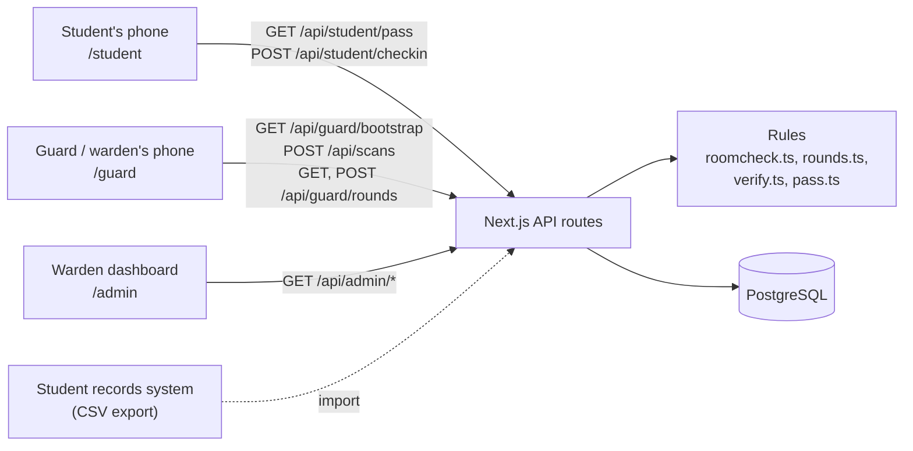
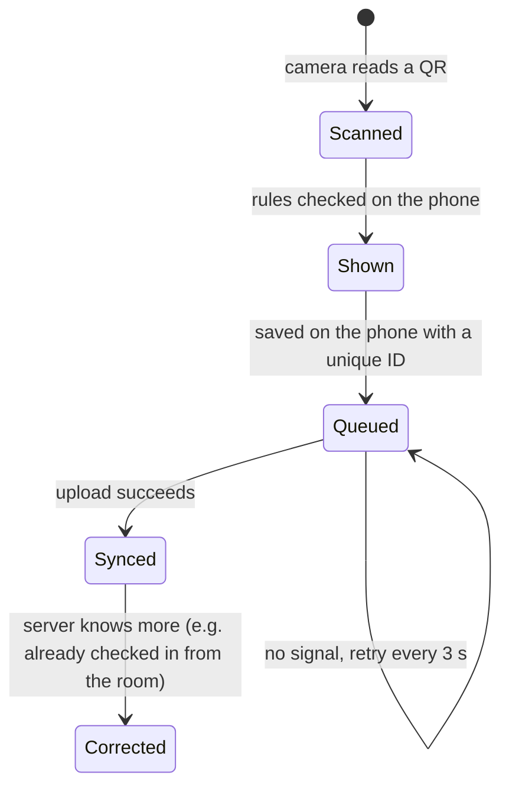
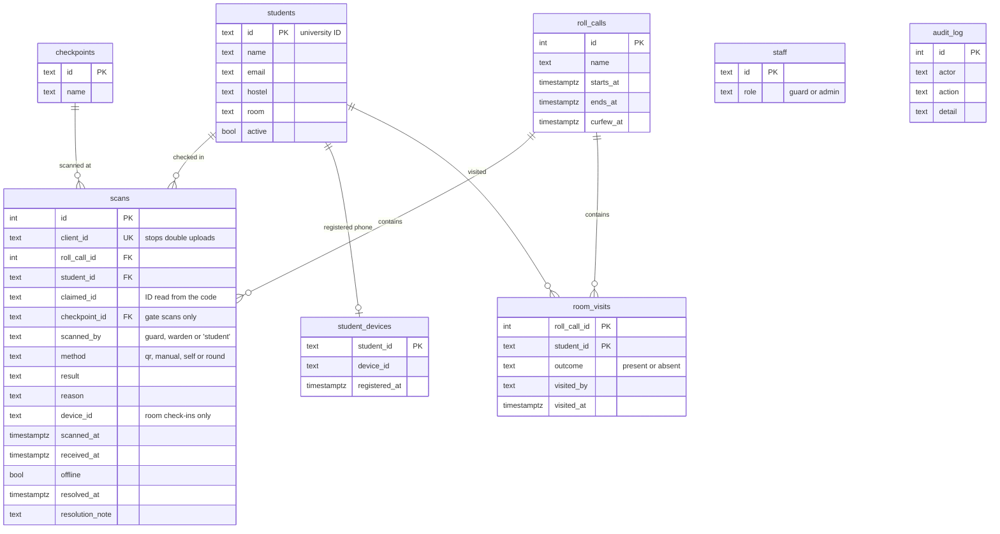

# Technical overview

This document explains how NightPass is put together and why we made the choices we did.

## The idea in one paragraph

Checking every room every night is slow, and scanning everyone at a gate only moves the queue somewhere else. NightPass lets students who are already in their room confirm it themselves, makes that confirmation hard to fake, and then sends the warden only to the rooms where something is missing or uncertain. The gate scanner is kept for students who come back late.

## Architecture



NightPass is a single Next.js 16 app. It serves three front ends (student, guard/warden phone, warden dashboard) and a small JSON API.

- **Access control.** `src/proxy.ts` checks the session cookie before any student, guard or warden page loads, and sends people to the right screen for their role. Every API route checks the role again (`authorize()` in `src/lib/auth.ts`), so the API can't be used to get around the pages.
- **Rules live in plain functions.** Room check-in is in `src/lib/roomcheck.ts`, the rounds list in `src/lib/rounds.ts`, and the gate scan rules in `src/lib/verify.ts`. They take a database handle and the current time, so they are easy to test, and the browser demo runs the very same functions.
- **Database.** `src/lib/db.ts` connects to Postgres if `DATABASE_URL` is set. If it isn't, it starts PGlite, a build of Postgres that runs inside Node and stores its files in `./.data`. Both use the same SQL, so anyone can clone the repo and run the full system with `npm run dev`.

## Room check-in

A student taps **Check in from my room** and scans the tag on the back of their door. The phone sends `{ tag, deviceId }` to `POST /api/student/checkin`, and `roomCheckIn()` decides.

### Room tags

```
NR1.<base64url("A-Block\nA-214")>.<Ed25519 signature>
```

Each room has one tag, signed with the university's private key (`signRoomTag` in `src/lib/roomtag.ts`). Nobody can make a tag for a room themselves, and editing the room inside a tag breaks the signature. The warden prints them from the dashboard (**Students**, then **Room tags**).

A tag never changes, so it could be photographed. That is why a tag is never enough by itself.

### The three proofs

The checks run in this order. Every refusal is saved as a scan with method `self`, result `invalid` and the reason, so it appears under **Needs review** and puts the student on tonight's rounds.

| Order | Check | If it fails |
| --- | --- | --- |
| 1 | Student is on the active list | Refused |
| 2 | The check-in window is open (from 90 minutes before curfew) | "Room check-in opens at 21:00". Not recorded. |
| 3 | Not already checked in tonight | "You're already checked in". Not recorded. |
| 4 | **Right phone:** the device ID matches the one registered to the student | Refused: "tried from a phone that isn't registered to this student" |
| 5 | **Right network:** the request comes from the hostel Wi-Fi ranges | Refused: "tried from outside the hostel network" |
| 6 | **Genuine tag:** the signature is valid | Refused: "isn't a NightPass room tag" |
| 7 | **Right room:** the tag is for the student's own room | Refused: "Scanned the tag for room A-109, but is assigned to room A-214" |

If everything passes, the check-in is saved as `valid` ("Checked in from room A-214"), or `late` if curfew has passed.

- **Registered phone.** The first time a student checks in, the app creates a random ID, keeps it on the phone, and the server stores it in `student_devices`. After that only this phone can check in for that student. Changing phones goes through the hostel office. A phone registered tonight is also a reason for a spot check.
- **Hostel network.** `isOnCampus()` in `src/lib/network.ts` compares the address the request arrived from with the ranges in `CAMPUS_NETWORKS` (for example `10.20.0.0/16`). The server decides this from the request. The phone doesn't get a say. When the variable isn't set, as in local development, every request counts as on campus.
- **Time window.** `checkInOpensAt()` opens check-in 90 minutes before curfew. A check-in after curfew still counts, but is marked late.

## The warden's rounds

`buildRounds()` in `src/lib/rounds.ts` builds tonight's list from the database each time it's asked. A student goes on the list if:

| Group | Rule | Reason shown on the card |
| --- | --- | --- |
| Missing | No check-in of any kind tonight | "No check-in tonight", or "No check-in, and a rejected attempt tonight" |
| Spot check | Checked in from the room, and had a refused attempt tonight | "Had a rejected attempt tonight" |
| Spot check | Checked in from the room, on a phone registered tonight | "New phone registered tonight" |
| Spot check | Checked in from the room, and missed 2 or more of the last 6 nights | "Missed 3 of the last 6 nights" |
| Spot check | Checked in from the room, none of the above, picked by the random sample (6%) | "Picked at random" |

Students scanned at the gate by a guard, or entered by hand, were seen in person, so they are never on the list.

- **The random sample is stable.** It's a hash of the student ID and the night, not a fresh dice roll, so the list doesn't reshuffle every time the phone refreshes. It changes from night to night, so students can't know in advance.
- **Walking order.** The list is sorted by block, then by room number.
- **One tap per door.** `recordVisit()` saves the outcome in `room_visits` (one row per student per night, so a second tap just corrects the first).
  - **In room:** if the student had no check-in, they are now marked present ("Seen in the room during rounds").
  - **Not in room**, for a student who had checked in from the room: the check-in is overturned. Its result becomes `absent` with the reason "Checked in from the room at 22:08, but was not there during rounds at 22:47", and it goes to **Needs review**. The student is back on the missing list.
  - **Not in room**, for a student with no check-in: an `absent` record is added.

On our sample data (150 students, about 86% in by curfew, about 62% of those using room check-in) a typical night's list is 30 to 34 rooms.

## The gate pass

Students who come back late are scanned at the gate. A pass looks like this:

```
NP1.2024A7PS0112U.1z2qgj.<Ed25519 signature, 86 characters>
 |   |             |
 |   |             +-- time slot: unix seconds / 15, in base 36
 |   +-- student ID
 +-- format version
```

- The server signs `NP1.<id>.<slot>` with the Ed25519 private key (`QR_SIGNING_KEY`). This key never leaves the server.
- Guard phones get only the matching public key. With it they can check a signature, but they can't create a pass.
- The student's phone downloads the next 20 minutes of passes at once (80 codes, about 9 KB) and shows the one for the current 15-second slot. It corrects for the phone's clock using the server time. This is why the pass still works with no internet.
- A pass is accepted if it is no more than 2 slots old (roughly 30 to 45 seconds) and no more than 1 slot ahead (in case the student's clock is fast).

### Gate scan rules

The checks run in this order (`verifyPass` and `verifyManual` in `src/lib/verify.ts`). The same file runs on the guard's phone (instant result, works offline) and on the server (final decision).

| Order | Check | Result | Counts as present | Needs review |
| --- | --- | --- | --- | --- |
| 1 | Doesn't look like a NightPass code | `invalid`: "Not a NightPass code" | No | Yes |
| 2 | Signature doesn't match | `invalid`: "forged or altered code" | No | Yes |
| 3 | More than 2 slots old | `expired`: "Possible screenshot" | No | Yes |
| 4 | More than 1 slot in the future | `invalid`: "check the phone's clock" | No | Yes |
| 5 | Student not on the active list | `unknown` | No | Yes |
| 6 | Student already checked in tonight | `duplicate`: "Already checked in at 21:59, Room check-in" | No | Yes |
| 7 | Guard entered it by hand | `manual`, with the reason | Yes | Yes |
| 8 | After curfew | `late`: "12 min after curfew" | Yes | Yes |
| 9 | Everything is fine | `valid` | Yes | No |

### Offline scanning and sync



- Every scan gets an ID generated on the phone (`client_id`, unique in the database). If the same batch is uploaded twice, the server just returns what it already saved. A bad connection can't create double entries.
- The guard's phone keeps a copy of the student list, who is already checked in, and the public key (`/api/guard/bootstrap`, refreshed every 15 seconds). That's enough to catch duplicates even while offline.
- Offline scans keep the time they were actually scanned (`scanned_at`) as well as the time the server received them (`received_at`), and are marked as offline in the records.

## One student, one check-in per night

A student might check in from the room at the same moment a guard scans them, or two gates might scan the same pass. The database has a partial unique index:

```sql
create unique index scans_one_presence on scans (roll_call_id, student_id)
  where result in ('valid', 'late', 'manual');
```

So a student can only be counted once per night, whichever way they were confirmed. If a second insert fails on this index, a gate scan is re-checked as a duplicate, and a room check-in simply answers "already checked in".

## Data model



- A **roll call** is one night. It's created automatically (18:00 to 06:00, curfew 22:30 campus time) the first time any screen needs it, so nobody has to set anything up. The warden can change the curfew or start a new roll call.
- **Every attempt is kept** in `scans`, including refused ones. Methods: `self` (room check-in), `qr` (gate scan), `manual` (guard entered it), `round` (warden at the door). Results: `valid`, `late`, `manual`, `duplicate`, `expired`, `invalid`, `unknown`, `absent`.
- The tables are created on first start. `schema.ts` also carries the few `alter table` lines needed to upgrade a database made by an earlier version.

## API

| Method and path | Who can call it | What it does |
| --- | --- | --- |
| `POST /api/auth/login` | anyone | Demo sign-in (would be replaced by the Google sign-in callback) |
| `POST /api/auth/logout` | anyone | Signs out |
| `GET /api/student/pass` | student | Profile, tonight's status, when room check-in opens, 20 minutes of gate passes, last 6 nights |
| `POST /api/student/checkin` | student | Room check-in: `{ tag, deviceId }`. Returns `{ ok, result, message }` |
| `GET /api/guard/bootstrap` | guard, warden | Tonight's roll call, gates, student list, who is in, public key |
| `POST /api/scans` | guard, warden | Upload up to 500 gate scans; returns the final result for each |
| `GET /api/guard/rounds` | guard, warden | Tonight's list of rooms to visit, with reasons and progress |
| `POST /api/guard/rounds` | guard, warden | Record a visit: `{ studentId, outcome: "present" or "absent" }` |
| `GET /api/admin/overview` | warden | Counts, how students were confirmed, per-block progress, rounds, 7-night trend, recent scans, flags, missing list |
| `GET /api/admin/records` | warden | Search by `q`, `result` (also `present`, `flagged`, `open`), `hostel`, `rollCallId`, `from`, `to` |
| `GET /api/admin/export` | warden | CSV download: `kind=records` (same filters) or `kind=missing` |
| `POST /api/admin/flags/:id` | warden | Mark a flagged record as reviewed, with a note |
| `POST /api/admin/rollcall` | warden | `{action:"curfew", rollCallId, time}` or `{action:"new"}` |
| `GET/POST /api/admin/roster` | warden | List students, or import a CSV (`id,name,email,hostel,room[,active]`) |
| `GET /api/admin/roomtags` | warden | The signed tag for every room, for printing |
| `POST /api/admin/reset` | warden, demo only | Reload the demo data |

## Security

| Someone tries to | What stops it |
| --- | --- |
| Check in while still out of the hostel | The request doesn't come from the hostel network. Refused and recorded, so the room goes on tonight's rounds. |
| Have a friend check in for them from the friend's phone | Not the registered phone. Refused and recorded. |
| Check in with a photo of their room tag from somewhere else | The network check refuses it. Inside the hostel, see the limits below. |
| Scan another room's tag | Tags are per room. Refused, with both rooms in the record. |
| Print their own tag or pass | They'd need the private key, which is only on the server. |
| Show a screenshot of someone's pass at the gate | Passes expire in 30 to 45 seconds. Flagged as expired. |
| Be counted twice | Checked on the phone and enforced by the database index. |
| Open the guard or warden screens as a student | The proxy redirects them, and the API returns 403. |
| Steal a session through injected scripts | Session cookies are `httpOnly`, `sameSite=lax` and `secure` in production. React escapes all output, and we don't inject raw HTML. |
| Hide formulas in exported data | Any cell starting with `=`, `+`, `-` or `@` gets a `'` in front. |

### What the checks can't prove, and what covers it

We'd rather be clear about this than oversell it.

- **A phone left in the room.** If a student leaves their own phone with a roommate, the roommate can check in for them. No app can tell who is holding a phone without fingerprints or face scans, which we chose not to collect. This is exactly what the random spot checks are for: each night a share of room check-ins gets a visit anyway, a failed visit cancels the check-in and is recorded, and missed nights raise the chance of being picked again.
- **The registered phone is an ID stored by the browser.** It stops the easy case (signing in on a friend's phone). A technical student could copy it to another device. In production we'd bind it to the device with a passkey (WebAuthn), which the phone's secure hardware won't export.
- **The network check shows the phone is on hostel Wi-Fi, not which room it's in.** The room tag covers the room, and a photographed tag is covered by the spot checks.

The design doesn't rely on any single check. The proofs make cheating take effort and a helper inside the hostel, and the spot checks make it likely to be caught over a few nights.

## The browser demo (GitHub Pages)

The live demo at https://rithikhc.github.io/CampusOPS/ has no server. It's a static export of the same screens (`npm run build:pages`), and the API runs in the visitor's browser:

- `next.config.ts` switches to a static export when `NIGHTPASS_STATIC=1`. In that mode it only picks up files ending in `.demo.tsx`, so the server-only pages and API routes are left out.
- `src/demo/client.ts` intercepts `fetch("/api/...")` calls. The student, guard and warden screens are unchanged and don't know they're in a demo.
- `src/demo/backend.ts` answers those calls with the same functions the server uses (`roomcheck.ts`, `rounds.ts`, `queries.ts`, `scans.ts`, `admin.ts`, `verify.ts`) on top of PGlite, which is Postgres compiled to WebAssembly and loaded from a CDN. Every visitor gets a fresh copy of the demo data, with curfew about 25 minutes away.
- `src/demo/DemoConsole.tsx` shows the three screens side by side in frames that share one in-browser database. So a check-in on the student's phone updates the dashboard and the warden's list, just like with the real server.
- Inside the demo page, the two phones use simulated cameras (`src/demo/camera.ts`): one draws the tag on a door, the other a phone holding up a pass. The scanner decodes them with the same code it uses for a real camera. "Outside the hostel" and "a friend's phone" are simulated by the demo buttons. Opened on its own on a phone, each page uses the real camera.

Two things we measured while building it:
- Running PGlite in a Web Worker made every query 7 to 10 times slower (the dashboard went from ~75 ms to ~700 ms), so it runs in the page.
- Inserting the demo data as one JSON value per table (`json_to_recordset`) instead of thousands of parameters cut first load from about 24 s to about 13 s.

The demo video was recorded from this page in presentation mode (`?present`), which hides the controls and shows captions.

## Tests

`npm test` runs 34 tests with Vitest. The room check-in, rounds and demo-data tests run against a real in-memory Postgres (PGlite), not mocks.

- `tests/verify.test.ts`: forged codes, edited IDs, old screenshots, clock differences, duplicates, curfew, manual entry.
- `tests/roomcheck.test.ts`: tag signing and tampering, each check-in refusal, phone registration, the check-in window, what goes on the rounds list, and how a visit overturns a check-in.
- `tests/seed.test.ts`: the demo data stays consistent at any time of night.

## Moving from prototype to production

| In the prototype | In a real rollout |
| --- | --- |
| Demo accounts (`DEMO_MODE=true`) | Google sign-in with university accounts, limited to the university domain. Only `src/app/api/auth/login` needs to change. |
| Registered phone is a random ID kept by the browser | A passkey (WebAuthn) bound to the phone |
| `CAMPUS_NETWORKS` left empty | The hostel Wi-Fi address ranges from campus IT |
| Student list uploaded as CSV | Scheduled sync from the student records system |
| PGlite or a single Postgres | Managed Postgres with backups, and a job that deletes records older than a semester |
| Development keys | `QR_SIGNING_KEY` and `AUTH_SECRET` stored as secrets |
| Fixed 6% random sample | A rate the warden can set per hostel |
| Dashboard refreshes every 4 seconds | Server push if lots of dashboards are open at once |

## Why we chose this approach

- **Check in from the room instead of scanning everyone at a gate.** A gate scan only tells you someone entered the building, and it creates a queue at curfew. The current process checks rooms, so we kept the room as the thing being checked and removed the walking.
- **Several cheap proofs plus spot checks, instead of one strong one.** Fingerprints, face scans or Bluetooth beacons in every room would be stronger, but they need hardware, cost money and collect sensitive data. A signed sticker, the phone the student already has, the Wi-Fi the hostel already has, and a few surprise visits get most of the way for the price of printing.
- **A web app instead of a native app.** Nothing to install from an app store, it works on any phone, and it can still be added to the home screen. The browser gives us the camera, keeping the screen on, and vibration, which is all we need.
- **Check on the phone first at the gate.** The guard gets a result without waiting for the network, which works with no signal. The server still has the final say.
- **Postgres throughout.** The data is relational (students, nights, check-ins, visits) and the warden needs filters and reports. PGlite means anyone can run the whole thing locally with one command.
