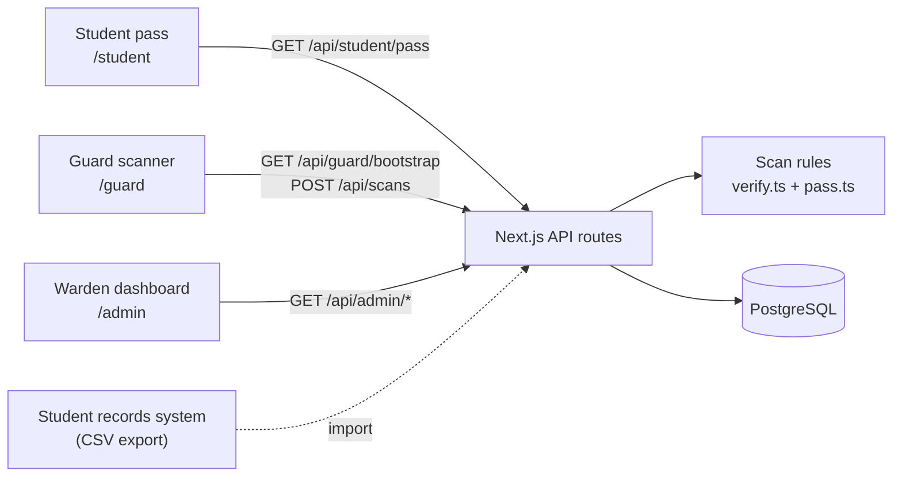
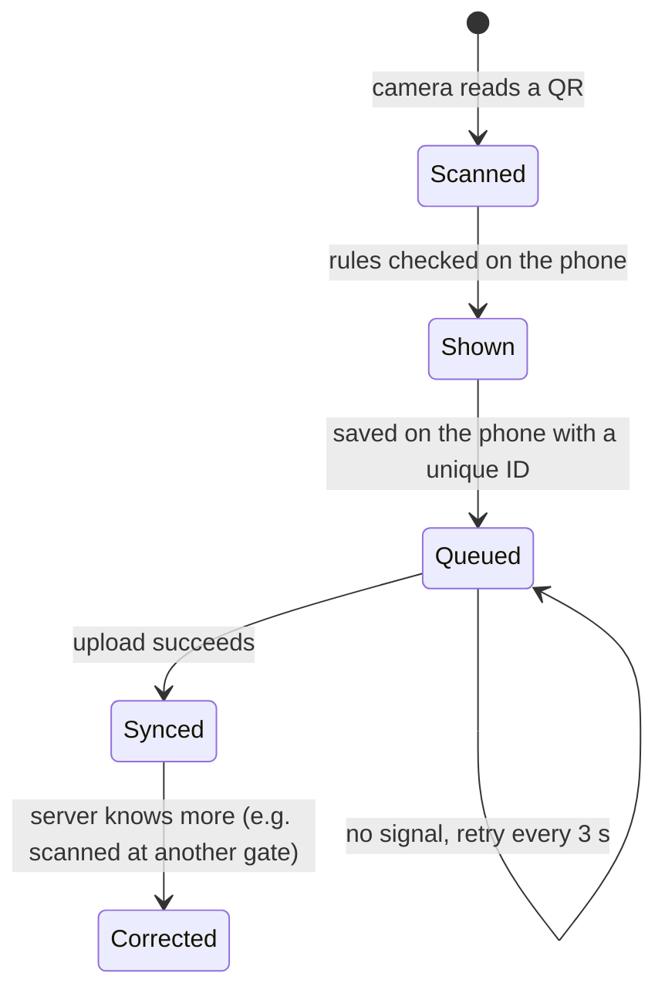
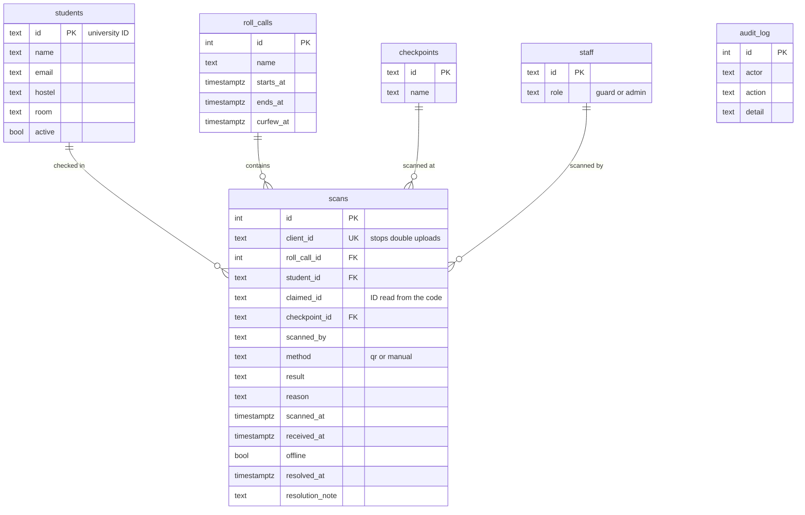

# Technical overview

This document explains how NightPass is put together and why we made the choices we did.

## Architecture



NightPass is a single Next.js 16 app. It serves three front ends (student, guard, warden) and a small JSON API.

- **Access control.** `src/proxy.ts` checks the session cookie before any student, guard or warden page loads, and sends people to the right screen for their role. Every API route checks the role again (`authorize()` in `src/lib/auth.ts`), so the API can't be used to get around the pages.
- **One set of scan rules.** The rules that decide whether a scan is accepted are in `src/lib/verify.ts`. The same file runs on the guard's phone (instant result, works offline) and on the server (final decision).
- **Database.** `src/lib/db.ts` connects to Postgres if `DATABASE_URL` is set. If it isn't, it starts PGlite, a build of Postgres that runs inside Node and stores its files in `./.data`. Both use the same SQL, so anyone can clone the repo and run the full system with `npm run dev`.

## The QR pass

A pass looks like this:

```
NP1.2024A7PS0112U.1z2qgj.<Ed25519 signature, 86 characters>
 |   |             |
 |   |             +-- time slot: unix seconds / 15, in base 36
 |   +-- student ID
 +-- format version
```

- The server signs `NP1.<id>.<slot>` with an Ed25519 private key (`QR_SIGNING_KEY`). This key never leaves the server.
- Guard phones get only the matching public key. With it they can check a signature, but they can't create a pass.
- The student's phone downloads the next 20 minutes of passes at once (80 codes, about 9 KB) and shows the one for the current 15-second slot. It corrects for the phone's clock using the server time. This is why the pass still works with no internet.
- A pass is accepted if it is no more than 2 slots old (roughly 30 to 45 seconds) and no more than 1 slot ahead (in case the student's clock is fast).
- The whole code is about 110 characters, which makes a QR code that is easy to scan off a phone screen in low light.

**Why not just print a QR on the ID card?** A fixed code can be photographed and shared forever. A code that changes every 15 seconds and is signed by the server is useless as a screenshot, and the guard's phone can check it without going online.

## Scan rules

The checks run in this order (`verifyPass` and `verifyManual` in `src/lib/verify.ts`):

| Order | Check | Result | Counts as present | Needs review |
| --- | --- | --- | --- | --- |
| 1 | Doesn't look like a NightPass code | `invalid`: "Not a NightPass code" | No | Yes |
| 2 | Signature doesn't match | `invalid`: "forged or altered code" | No | Yes |
| 3 | More than 2 slots old | `expired`: "Possible screenshot" | No | Yes |
| 4 | More than 1 slot in the future | `invalid`: "check the phone's clock" | No | Yes |
| 5 | Student not on the active list | `unknown` | No | Yes |
| 6 | Student already checked in tonight | `duplicate`: "Already checked in at 21:59, B-Block Gate" | No | Yes |
| 7 | Guard entered it by hand | `manual`, with the reason | Yes | Yes |
| 8 | After curfew | `late`: "12 min after curfew" | Yes | Yes |
| 9 | Everything is fine | `valid` | Yes | No |

`tests/verify.test.ts` covers each of these: forged codes, edited IDs, old screenshots, clock differences, duplicates, curfew and manual entry.

## Offline scanning and sync



- Every scan gets an ID generated on the phone (`client_id`, unique in the database). If the same batch is uploaded twice, the server just returns what it already saved. A bad connection can't create double entries.
- The guard's phone keeps a copy of the student list, who is already checked in, and the public key (`/api/guard/bootstrap`, refreshed every 15 seconds). That's enough to catch duplicates even while offline.
- **Two gates scanning the same student at the same moment.** The database has a partial unique index, `unique (roll_call_id, student_id) where result in ('valid','late','manual')`, so a student can only be counted once per night. If the second insert fails, the server re-checks it as a duplicate and the guard's phone is told.
- Offline scans keep the time they were actually scanned (`scanned_at`) as well as the time the server received them (`received_at`), and are marked as offline in the records.

## Data model



- A **roll call** is one night. It's created automatically (18:00 to 06:00, curfew 22:30 campus time) the first time any screen needs it, so guards never have to set anything up. The warden can change the curfew or start a new roll call.
- **Every scan attempt is kept**, including rejected ones. That table is the record of everything that happened at the gates.

## API

| Method and path | Who can call it | What it does |
| --- | --- | --- |
| `POST /api/auth/login` | anyone | Demo sign-in (would be replaced by the Google sign-in callback) |
| `POST /api/auth/logout` | anyone | Signs out |
| `GET /api/student/pass` | student | Profile, tonight's status, 20 minutes of passes, last 6 nights |
| `GET /api/guard/bootstrap` | guard, warden | Tonight's roll call, gates, student list, who is in, public key |
| `POST /api/scans` | guard, warden | Upload up to 500 scans; returns the final result for each |
| `GET /api/admin/overview` | warden | Counts, per-block progress, check-ins over time, 7-night trend, recent scans, flags, missing list |
| `GET /api/admin/records` | warden | Search by `q`, `result` (also `present`, `flagged`, `open`), `hostel`, `rollCallId`, `from`, `to` |
| `GET /api/admin/export` | warden | CSV download: `kind=records` (same filters) or `kind=missing` |
| `POST /api/admin/flags/:id` | warden | Mark a flagged scan as reviewed, with a note |
| `POST /api/admin/rollcall` | warden | `{action:"curfew", rollCallId, time}` or `{action:"new"}` |
| `GET/POST /api/admin/roster` | warden | List students, or import a CSV (`id,name,email,hostel,room[,active]`) |
| `POST /api/admin/reset` | warden, demo only | Reload the demo data |

## Security

| Risk | What stops it |
| --- | --- |
| A friend shows a screenshot of someone's pass | Passes expire in 30 to 45 seconds. The scan is flagged as expired, and the student shows up on the missing list with a rejected scan next to their name. |
| Someone edits the ID inside the QR | The signature no longer matches, so it's flagged as invalid. |
| Someone makes their own QR | They'd need the private key, which is only on the server. |
| The same pass is used at two gates | Checked on the phone and enforced by the database. Flagged as a duplicate. |
| A student opens the guard or warden screen | The proxy redirects them, and the API returns 403. |
| Stealing a session through injected scripts | Session cookies are `httpOnly`, `sameSite=lax` and `secure` in production. React escapes all output, and we don't inject raw HTML. |
| Spreadsheet formulas in exported data | Any cell starting with `=`, `+`, `-` or `@` gets a `'` in front. |
| A guard's phone is lost | Sessions expire after 12 hours. The phone only holds names, IDs, blocks and rooms, and it can't create passes. |

## Moving from prototype to production

| In the prototype | In a real rollout |
| --- | --- |
| Demo accounts (`DEMO_MODE=true`) | Google sign-in with university accounts, limited to the university domain. Only `src/app/api/auth/login` needs to change. |
| Student list uploaded as CSV | Scheduled sync from the student records system |
| PGlite or a single Postgres | Managed Postgres with backups, and a job that deletes scans older than a semester |
| Development keys | `QR_SIGNING_KEY` and `AUTH_SECRET` stored as secrets. Keys can be rotated by accepting two public keys for a short overlap. |
| Initials instead of photos | ID-card photo on the scan result |
| Dashboard refreshes every 4 seconds | Server push if lots of dashboards are open at once |

## Why we chose this approach

- **A web app instead of a native app.** Nothing to install from an app store, it works on any phone, and it can still be added to the home screen. The browser gives us the camera, keeping the screen on, and vibration, which is all we need.
- **Check on the phone first.** The guard gets a result without waiting for the network, which keeps the line moving and works with no signal. The server still has the final say and corrects the phone when it knows more.
- **Rotating signed QR instead of NFC, Bluetooth or fingerprints.** No hardware, no pairing, works on both iPhone and Android, and it stops the main way people cheat (sharing a pass) at almost no cost.
- **Postgres throughout.** The data is relational (students, nights, scans) and the warden needs filters and reports. PGlite means anyone can run the whole thing locally with one command.
